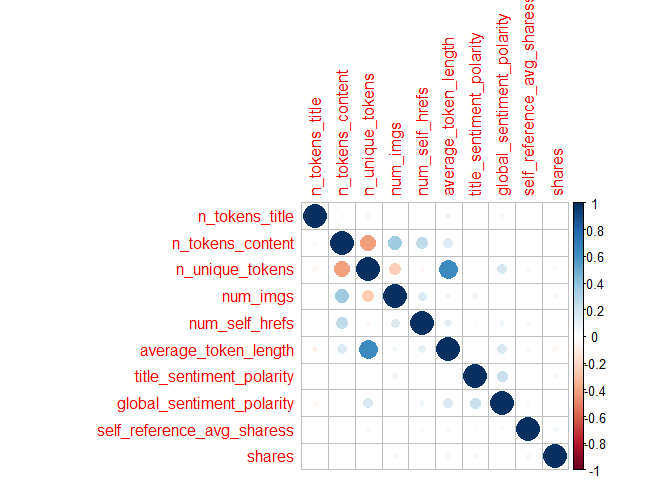
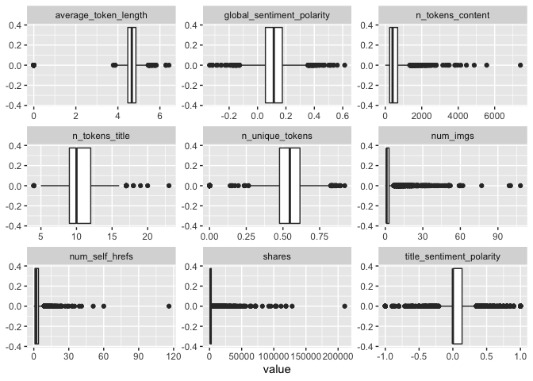
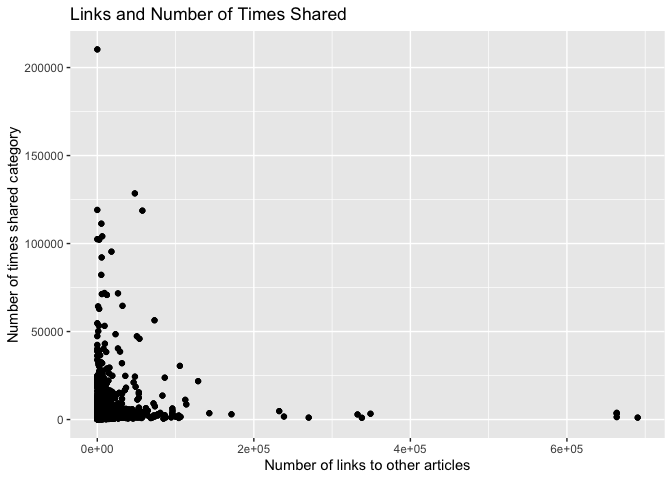

ProjectCode
================
Colleen Moore
10/8/2020

-   [Variable selection](#variable-selection)
-   [Create Training and Test Sets](#create-training-and-test-sets)
-   [Summarizations](#summarizations)
-   [Modeling](#modeling)
    -   [Tree based Model](#tree-based-model)
    -   [Boosted Tree Model](#boosted-tree-model)

*This analysis is for Friday*

Read in data

    news<- read_csv("OnlineNewsPopularity.csv")

    ## Parsed with column specification:
    ## cols(
    ##   .default = col_double(),
    ##   url = col_character()
    ## )

    ## See spec(...) for full column specifications.

Filter for the day of the week

    dailyNews <- filter(news, news[[paste0("weekday_is_",params$day)]] == "1")

### Variable selection

    dailyNews<- dailyNews %>% 
      mutate(channel= case_when(data_channel_is_bus == 1 ~ "Business",
                                             data_channel_is_entertainment==1 ~"Entertainment",
                                                data_channel_is_lifestyle== 1 ~ "Lifesytle",
                                                data_channel_is_socmed==1 ~ "SocialMedia",
                                                data_channel_is_tech==1 ~ "Tech",
                                                data_channel_is_world== 1 ~ "World")) %>% select(n_tokens_title, n_tokens_content, n_unique_tokens, num_imgs, num_self_hrefs, average_token_length, title_sentiment_polarity, global_sentiment_polarity, shares, channel)

Check dataset for missing values

    dailyNews %>% summarise_all(funs(sum(is.na(.))))

    ## # A tibble: 1 x 10
    ##   n_tokens_title n_tokens_content n_unique_tokens num_imgs num_self_hrefs
    ##            <int>            <int>           <int>    <int>          <int>
    ## 1              0                0               0        0              0
    ## # … with 5 more variables: average_token_length <int>,
    ## #   title_sentiment_polarity <int>, global_sentiment_polarity <int>,
    ## #   shares <int>, channel <int>

Since I created a new variable channel, some news articles did not fall
into any of the listed categories and so are NA values. Replace the NA
values with “None”

    dailyNews$channel <- ifelse(is.na(dailyNews$channel), "None", dailyNews$channel)

Create Training and Test Sets
-----------------------------

Split data into training and test set- 70% of the data will be used for
training and 30% will be used for testing.

    set.seed(2011)
    train <- sample(1:nrow(dailyNews), size = nrow(dailyNews)*0.7)
    test <- setdiff(1:nrow(dailyNews), train)
    dailyNewsTrain <- dailyNews[train, ]
    dailyNewsTest <- dailyNews[test, ]

Summarizations
--------------

Quick summary of all the variables in the dataset. Wanted to get an idea
of the ranges of the variables.

    kable(apply(dailyNewsTrain[1:9], 2, summary), caption = paste("Summary of Variables"), digits= 1)

<table>
<caption>
Summary of Variables
</caption>
<thead>
<tr>
<th style="text-align:left;">
</th>
<th style="text-align:right;">
n\_tokens\_title
</th>
<th style="text-align:right;">
n\_tokens\_content
</th>
<th style="text-align:right;">
n\_unique\_tokens
</th>
<th style="text-align:right;">
num\_imgs
</th>
<th style="text-align:right;">
num\_self\_hrefs
</th>
<th style="text-align:right;">
average\_token\_length
</th>
<th style="text-align:right;">
title\_sentiment\_polarity
</th>
<th style="text-align:right;">
global\_sentiment\_polarity
</th>
<th style="text-align:right;">
shares
</th>
</tr>
</thead>
<tbody>
<tr>
<td style="text-align:left;">
Min.
</td>
<td style="text-align:right;">
4.0
</td>
<td style="text-align:right;">
0.0
</td>
<td style="text-align:right;">
0.0
</td>
<td style="text-align:right;">
0.0
</td>
<td style="text-align:right;">
0.0
</td>
<td style="text-align:right;">
0.0
</td>
<td style="text-align:right;">
-1.0
</td>
<td style="text-align:right;">
-0.3
</td>
<td style="text-align:right;">
22.0
</td>
</tr>
<tr>
<td style="text-align:left;">
1st Qu.
</td>
<td style="text-align:right;">
9.0
</td>
<td style="text-align:right;">
240.0
</td>
<td style="text-align:right;">
0.5
</td>
<td style="text-align:right;">
1.0
</td>
<td style="text-align:right;">
1.0
</td>
<td style="text-align:right;">
4.5
</td>
<td style="text-align:right;">
0.0
</td>
<td style="text-align:right;">
0.1
</td>
<td style="text-align:right;">
965.2
</td>
</tr>
<tr>
<td style="text-align:left;">
Median
</td>
<td style="text-align:right;">
10.0
</td>
<td style="text-align:right;">
401.0
</td>
<td style="text-align:right;">
0.5
</td>
<td style="text-align:right;">
1.0
</td>
<td style="text-align:right;">
2.0
</td>
<td style="text-align:right;">
4.7
</td>
<td style="text-align:right;">
0.0
</td>
<td style="text-align:right;">
0.1
</td>
<td style="text-align:right;">
1400.0
</td>
</tr>
<tr>
<td style="text-align:left;">
Mean
</td>
<td style="text-align:right;">
10.4
</td>
<td style="text-align:right;">
524.2
</td>
<td style="text-align:right;">
0.5
</td>
<td style="text-align:right;">
4.4
</td>
<td style="text-align:right;">
3.1
</td>
<td style="text-align:right;">
4.6
</td>
<td style="text-align:right;">
0.1
</td>
<td style="text-align:right;">
0.1
</td>
<td style="text-align:right;">
3316.7
</td>
</tr>
<tr>
<td style="text-align:left;">
3rd Qu.
</td>
<td style="text-align:right;">
12.0
</td>
<td style="text-align:right;">
679.5
</td>
<td style="text-align:right;">
0.6
</td>
<td style="text-align:right;">
3.0
</td>
<td style="text-align:right;">
4.0
</td>
<td style="text-align:right;">
4.9
</td>
<td style="text-align:right;">
0.1
</td>
<td style="text-align:right;">
0.2
</td>
<td style="text-align:right;">
2700.0
</td>
</tr>
<tr>
<td style="text-align:left;">
Max.
</td>
<td style="text-align:right;">
23.0
</td>
<td style="text-align:right;">
7413.0
</td>
<td style="text-align:right;">
0.9
</td>
<td style="text-align:right;">
108.0
</td>
<td style="text-align:right;">
116.0
</td>
<td style="text-align:right;">
6.4
</td>
<td style="text-align:right;">
1.0
</td>
<td style="text-align:right;">
0.6
</td>
<td style="text-align:right;">
210300.0
</td>
</tr>
</tbody>
</table>

Correlation plot of variable choosen to be included in model. seeing if
any of the chosen variables are highly correlated with the response
variable shares or among each other.

    correlation <- dailyNewsTrain %>% keep(is.numeric) %>% cor()
    corrplot(correlation)

<!-- -->

Boxplots of all the variables to be used in the model to get an idea of
shape and if outliers are present.

    dailyNewsTrain %>%
    keep(is.numeric) %>%
    pivot_longer(everything()) %>%
    ggplot(aes(x = value)) +
    facet_wrap(~ name, scales = "free") +
    geom_boxplot()

<!-- -->

None of the variables appear to have a high correlation with the shares
variable. Below is a plot of number of links of other articles and
shares category.

    ggplot(dailyNewsTrain, aes(num_self_hrefs, shares))+ geom_point()+ geom_jitter() + labs(x= "Number of links to other articles", y= "Number of times shared category", title= "Links and Number of Times Shared")

<!-- -->

Modeling
--------

### Tree based Model

The first model is a classification tree-based model (not ensemble)
using leave one out cross validation. I will be using rpart from the
`caret` package for this tree.

    Tree_fit<- train(shares ~.,  data= dailyNewsTrain, method= "rpart",
                     trControl=trainControl(method = "LOOCV"),
                    preProcess = c("center", "scale"))

    Tree_fit

    ## CART 
    ## 
    ## 3990 samples
    ##    9 predictor
    ## 
    ## Pre-processing: centered (14), scaled (14) 
    ## Resampling: Leave-One-Out Cross-Validation 
    ## Summary of sample sizes: 3989, 3989, 3989, 3989, 3989, 3989, ... 
    ## Resampling results across tuning parameters:
    ## 
    ##   cp           RMSE      Rsquared     MAE     
    ##   0.006658026  8494.053  0.001698516  3150.577
    ##   0.019407357  8276.518  0.007759541  3062.201
    ##   0.020138782  8516.699  0.006975616  3502.875
    ## 
    ## RMSE was used to select the optimal model using the smallest value.
    ## The final value used for the model was cp = 0.01940736.

See how this model did on the training dataset

    pred_Tree_fit<- predict(Tree_fit, newdata= dailyNewsTest)
    modelA<- postResample(pred_Tree_fit, obs= dailyNewsTest$shares)
    modelA

    ##         RMSE     Rsquared          MAE 
    ## 7.814140e+03 2.129224e-02 2.860204e+03

### Boosted Tree Model

The next model is a classification boosted tree model with parameters
choosen using cross validation. I chose the Stochastic Gradient Boosting
method (gbm method).

    fit_control <- trainControl(method="cv", number=10)

    grid <- expand.grid(n.trees=c(25, 50, 100, 200,500), shrinkage=c(0.05, 0.1, 0.15),
                        n.minobsinnode = c(5,10, 15),interaction.depth=1)

    boostedTree <-train(shares ~ ., data= dailyNewsTrain, method='gbm', trControl=fit_control, tuneGrid=grid, verbose= FALSE)

    boostedTree

    ## Stochastic Gradient Boosting 
    ## 
    ## 3990 samples
    ##    9 predictor
    ## 
    ## No pre-processing
    ## Resampling: Cross-Validated (10 fold) 
    ## Summary of sample sizes: 3591, 3590, 3590, 3591, 3593, 3590, ... 
    ## Resampling results across tuning parameters:
    ## 
    ##   shrinkage  n.minobsinnode  n.trees  RMSE      Rsquared     MAE     
    ##   0.05        5               25      7982.998  0.012523966  3038.252
    ##   0.05        5               50      8007.536  0.009911337  3042.592
    ##   0.05        5              100      8015.006  0.011723106  3040.659
    ##   0.05        5              200      8030.005  0.012506912  3046.965
    ##   0.05        5              500      8042.016  0.017756678  3046.254
    ##   0.05       10               25      7952.857  0.014873567  3032.734
    ##   0.05       10               50      7959.497  0.016256100  3031.516
    ##   0.05       10              100      7969.021  0.018105755  3035.869
    ##   0.05       10              200      7977.234  0.018557035  3042.633
    ##   0.05       10              500      7969.262  0.021147397  3037.520
    ##   0.05       15               25      7940.356  0.023852468  3021.339
    ##   0.05       15               50      7948.875  0.020977808  3032.885
    ##   0.05       15              100      7948.638  0.022863504  3033.537
    ##   0.05       15              200      7948.315  0.023619944  3026.557
    ##   0.05       15              500      7950.476  0.024152918  3028.723
    ##   0.10        5               25      8008.582  0.009629944  3042.091
    ##   0.10        5               50      8007.059  0.014709285  3047.979
    ##   0.10        5              100      8023.116  0.012967733  3048.073
    ##   0.10        5              200      8047.708  0.013014448  3058.687
    ##   0.10        5              500      8092.864  0.016254856  3052.012
    ##   0.10       10               25      7948.503  0.018437957  3042.379
    ##   0.10       10               50      7948.199  0.022622764  3038.848
    ##   0.10       10              100      7955.476  0.022763489  3037.194
    ##   0.10       10              200      7956.614  0.022532869  3041.864
    ##   0.10       10              500      7989.363  0.022986756  3053.967
    ##   0.10       15               25      7942.166  0.023154945  3031.535
    ##   0.10       15               50      7952.056  0.021617989  3024.902
    ##   0.10       15              100      7948.672  0.023939942  3022.224
    ##   0.10       15              200      7943.191  0.026525077  3040.029
    ##   0.10       15              500      7963.193  0.025194285  3063.561
    ##   0.15        5               25      8047.682  0.007937041  3038.871
    ##   0.15        5               50      8065.070  0.011131247  3074.035
    ##   0.15        5              100      8070.842  0.012530705  3082.521
    ##   0.15        5              200      8073.306  0.013630381  3044.484
    ##   0.15        5              500      8117.167  0.018423014  3078.770
    ##   0.15       10               25      7968.695  0.017857468  3035.371
    ##   0.15       10               50      7989.727  0.018420082  3036.443
    ##   0.15       10              100      7958.905  0.023986590  3035.488
    ##   0.15       10              200      7986.628  0.024953073  3047.396
    ##   0.15       10              500      8032.041  0.019608789  3073.694
    ##   0.15       15               25      7954.174  0.021077223  3025.765
    ##   0.15       15               50      7954.488  0.022849002  3025.750
    ##   0.15       15              100      7953.265  0.023000281  3040.343
    ##   0.15       15              200      7947.953  0.025256004  3038.617
    ##   0.15       15              500      7971.995  0.025204071  3074.581
    ## 
    ## Tuning parameter 'interaction.depth' was held constant at a value of 1
    ## RMSE was used to select the optimal model using the smallest value.
    ## The final values used for the model were n.trees = 25, interaction.depth =
    ##  1, shrinkage = 0.05 and n.minobsinnode = 15.

Test the model on the test dataset.

    pred_boostedTree<- predict(boostedTree, newdata= dailyNewsTest)
    modelB<- postResample(pred_boostedTree, obs= dailyNewsTest$shares)
    modelB

    ##         RMSE     Rsquared          MAE 
    ## 7.863939e+03 8.740231e-03 2.872975e+03

Out of the two models, the one with the lowest RMSE of 7814.1399 was the
tree based model
