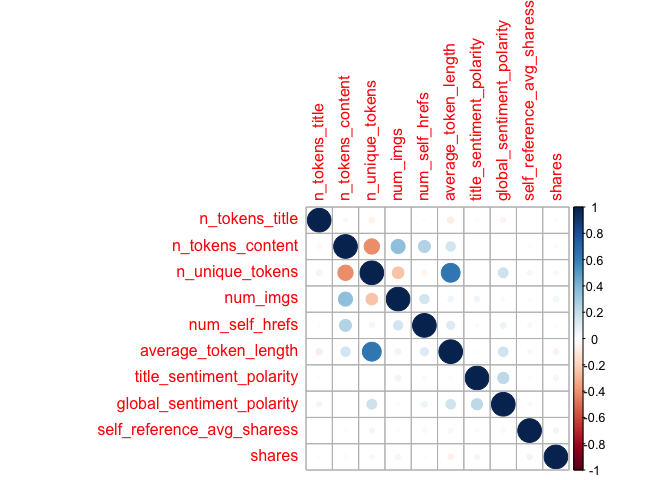
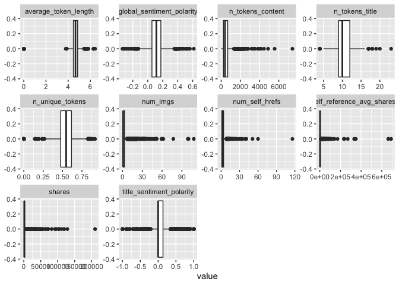

ProjectCode
================
Colleen Moore
10/8/2020

-   [\*\* Analysis for Friday \*\*](#analysis-for-friday)
    -   [Read in data](#read-in-data)
        -   [Filter for the day of the
            week](#filter-for-the-day-of-the-week)
    -   [Variable selection](#variable-selection)
        -   [Code for variable select and
            modification](#code-for-variable-select-and-modification)
        -   [Check dataset for missing
            values](#check-dataset-for-missing-values)
    -   [Create Training and Test Sets](#create-training-and-test-sets)
    -   [Summarizations](#summarizations)
        -   [Summary of all the included
            variables](#summary-of-all-the-included-variables)
        -   [Correlation plot](#correlation-plot)
        -   [Boxplots](#boxplots)
        -   [Scatterplot](#scatterplot)
    -   [Modeling](#modeling)
        -   [Tree based Model](#tree-based-model)
        -   [Boosted Tree Model](#boosted-tree-model)
    -   [Part 2 - Laura Mathews](#part-2---laura-mathews)
    -   [Best Model](#best-model)

\*\* Analysis for Friday \*\*
=============================

Read in data
------------

    news<- read_csv("OnlineNewsPopularity.csv")

### Filter for the day of the week

    dailyNews <- filter(news, news[[paste0("weekday_is_",params$day)]] == "1")

Variable selection
------------------

The variables I chose were:

-   n\_tokens\_title: Number of words in the title  
-   n\_tokens\_content: Number of words in the content  
-   n\_unique\_tokens: Rate of unique words in the content  
-   num\_imgs: Number of images  
-   num\_self\_hrefs: Number of links to other articles published by
    Mashable  
-   average\_token\_length: Average length of the words in the content  
-   self\_reference\_avg\_sharess: Avg. shares of referenced articles in
    Mashable
-   global\_sentiment\_polarity: Text sentiment polarity
-   data\_channel - which is a derived variable from:
    -   data\_channel\_is\_lifestyle: Is data channel ‘Lifestyle’?
    -   data\_channel\_is\_entertainment: Is data channel
        ‘Entertainment’?
    -   data\_channel\_is\_bus: Is data channel ‘Business’?
    -   data\_channel\_is\_socmed: Is data channel ‘Social Media’?
    -   data\_channel\_is\_tech: Is data channel ‘Tech’?
    -   data\_channel\_is\_world: Is data channel ‘World’?
-   title\_sentiment\_polarity: Title polarity

### Code for variable select and modification

    dailyNews<- dailyNews %>% 
      mutate(channel= case_when(data_channel_is_bus == 1 ~ "Business",
                                             data_channel_is_entertainment==1 ~"Entertainment",
                                                data_channel_is_lifestyle== 1 ~ "Lifesytle",
                                                data_channel_is_socmed==1 ~ "SocialMedia",
                                                data_channel_is_tech==1 ~ "Tech",
                                                data_channel_is_world== 1 ~ "World")) %>% 
      select(n_tokens_title, n_tokens_content, n_unique_tokens, num_imgs, num_self_hrefs, 
             average_token_length, title_sentiment_polarity, global_sentiment_polarity,
             self_reference_avg_sharess, shares, channel)

### Check dataset for missing values

    miss<- dailyNews %>% summarise_all(funs(sum(is.na(.))))
    kable(miss)

<table>
<thead>
<tr>
<th style="text-align:right;">
n\_tokens\_title
</th>
<th style="text-align:right;">
n\_tokens\_content
</th>
<th style="text-align:right;">
n\_unique\_tokens
</th>
<th style="text-align:right;">
num\_imgs
</th>
<th style="text-align:right;">
num\_self\_hrefs
</th>
<th style="text-align:right;">
average\_token\_length
</th>
<th style="text-align:right;">
title\_sentiment\_polarity
</th>
<th style="text-align:right;">
global\_sentiment\_polarity
</th>
<th style="text-align:right;">
self\_reference\_avg\_sharess
</th>
<th style="text-align:right;">
shares
</th>
<th style="text-align:right;">
channel
</th>
</tr>
</thead>
<tbody>
<tr>
<td style="text-align:right;">
0
</td>
<td style="text-align:right;">
0
</td>
<td style="text-align:right;">
0
</td>
<td style="text-align:right;">
0
</td>
<td style="text-align:right;">
0
</td>
<td style="text-align:right;">
0
</td>
<td style="text-align:right;">
0
</td>
<td style="text-align:right;">
0
</td>
<td style="text-align:right;">
0
</td>
<td style="text-align:right;">
0
</td>
<td style="text-align:right;">
966
</td>
</tr>
</tbody>
</table>

Since I created a new variable channel, some news articles did not fall
into any of the listed categories and so are NA values. Replace the NA
values with “None”

    dailyNews$channel <- ifelse(is.na(dailyNews$channel), "None", dailyNews$channel)

Create Training and Test Sets
-----------------------------

Split data into training and test set- 70% of the data will be used for
training and 30% will be used for testing.

    set.seed(2011)
    train <- sample(1:nrow(dailyNews), size = nrow(dailyNews)*0.7)
    test <- setdiff(1:nrow(dailyNews), train)
    dailyNewsTrain <- dailyNews[train, ]
    dailyNewsTest <- dailyNews[test, ]

Summarizations
--------------

### Summary of all the included variables

Quick summary of all the variables in the dataset. Wanted to get an idea
of the ranges of the variables.

    kable(apply(dailyNewsTrain[1:10], 2, summary), caption = paste("Summary of Variables"), digits= 1)

<table>
<caption>
Summary of Variables
</caption>
<thead>
<tr>
<th style="text-align:left;">
</th>
<th style="text-align:right;">
n\_tokens\_title
</th>
<th style="text-align:right;">
n\_tokens\_content
</th>
<th style="text-align:right;">
n\_unique\_tokens
</th>
<th style="text-align:right;">
num\_imgs
</th>
<th style="text-align:right;">
num\_self\_hrefs
</th>
<th style="text-align:right;">
average\_token\_length
</th>
<th style="text-align:right;">
title\_sentiment\_polarity
</th>
<th style="text-align:right;">
global\_sentiment\_polarity
</th>
<th style="text-align:right;">
self\_reference\_avg\_sharess
</th>
<th style="text-align:right;">
shares
</th>
</tr>
</thead>
<tbody>
<tr>
<td style="text-align:left;">
Min.
</td>
<td style="text-align:right;">
4.0
</td>
<td style="text-align:right;">
0.0
</td>
<td style="text-align:right;">
0.0
</td>
<td style="text-align:right;">
0.0
</td>
<td style="text-align:right;">
0.0
</td>
<td style="text-align:right;">
0.0
</td>
<td style="text-align:right;">
-1.0
</td>
<td style="text-align:right;">
-0.3
</td>
<td style="text-align:right;">
0
</td>
<td style="text-align:right;">
22.0
</td>
</tr>
<tr>
<td style="text-align:left;">
1st Qu.
</td>
<td style="text-align:right;">
9.0
</td>
<td style="text-align:right;">
240.0
</td>
<td style="text-align:right;">
0.5
</td>
<td style="text-align:right;">
1.0
</td>
<td style="text-align:right;">
1.0
</td>
<td style="text-align:right;">
4.5
</td>
<td style="text-align:right;">
0.0
</td>
<td style="text-align:right;">
0.1
</td>
<td style="text-align:right;">
974
</td>
<td style="text-align:right;">
965.2
</td>
</tr>
<tr>
<td style="text-align:left;">
Median
</td>
<td style="text-align:right;">
10.0
</td>
<td style="text-align:right;">
401.0
</td>
<td style="text-align:right;">
0.5
</td>
<td style="text-align:right;">
1.0
</td>
<td style="text-align:right;">
2.0
</td>
<td style="text-align:right;">
4.7
</td>
<td style="text-align:right;">
0.0
</td>
<td style="text-align:right;">
0.1
</td>
<td style="text-align:right;">
2200
</td>
<td style="text-align:right;">
1400.0
</td>
</tr>
<tr>
<td style="text-align:left;">
Mean
</td>
<td style="text-align:right;">
10.4
</td>
<td style="text-align:right;">
524.2
</td>
<td style="text-align:right;">
0.5
</td>
<td style="text-align:right;">
4.4
</td>
<td style="text-align:right;">
3.1
</td>
<td style="text-align:right;">
4.6
</td>
<td style="text-align:right;">
0.1
</td>
<td style="text-align:right;">
0.1
</td>
<td style="text-align:right;">
6538
</td>
<td style="text-align:right;">
3316.7
</td>
</tr>
<tr>
<td style="text-align:left;">
3rd Qu.
</td>
<td style="text-align:right;">
12.0
</td>
<td style="text-align:right;">
679.5
</td>
<td style="text-align:right;">
0.6
</td>
<td style="text-align:right;">
3.0
</td>
<td style="text-align:right;">
4.0
</td>
<td style="text-align:right;">
4.9
</td>
<td style="text-align:right;">
0.1
</td>
<td style="text-align:right;">
0.2
</td>
<td style="text-align:right;">
5200
</td>
<td style="text-align:right;">
2700.0
</td>
</tr>
<tr>
<td style="text-align:left;">
Max.
</td>
<td style="text-align:right;">
23.0
</td>
<td style="text-align:right;">
7413.0
</td>
<td style="text-align:right;">
0.9
</td>
<td style="text-align:right;">
108.0
</td>
<td style="text-align:right;">
116.0
</td>
<td style="text-align:right;">
6.4
</td>
<td style="text-align:right;">
1.0
</td>
<td style="text-align:right;">
0.6
</td>
<td style="text-align:right;">
690400
</td>
<td style="text-align:right;">
210300.0
</td>
</tr>
</tbody>
</table>

### Correlation plot

Correlation plot of variable choosen to be included in model. Seeing if
any of the chosen variables are highly correlated with the response
variable shares or among each other.

    correlation <- dailyNewsTrain %>% keep(is.numeric) %>% cor()
    corrplot(correlation)

<!-- -->

None of the variables appear to have a high correlation with the shares
variable.

### Boxplots

Boxplots of all the variables to be used in the model to get an idea of
shape and if outliers are present.

    dailyNewsTrain %>%
    keep(is.numeric) %>%
    pivot_longer(everything()) %>%
    ggplot(aes(x = value)) +
    facet_wrap(~ name, scales = "free") +
    geom_boxplot()

<!-- -->

### Scatterplot

Below is a plot of self\_reference\_avg\_sharess (Avg. shares of
referenced articles in Mashable) and shares category.

    ggplot(dailyNewsTrain, aes(self_reference_avg_sharess,shares))+ 
      geom_point()+ geom_jitter() + 
      labs(x= "Number of links to other articles", y= "Number of times shared category", 
           title= "Links and Number of Times Shared")

<!-- -->

Modeling
--------

### Tree based Model

The first model is a classification tree-based model (not ensemble)
using leave one out cross validation. I will be using rpart from the
`caret` package for this tree.

    Tree_fit<- train(shares ~.,  data= dailyNewsTrain, method= "rpart",
                     trControl=trainControl(method = "LOOCV"),
                    preProcess = c("center", "scale"))

    Tree_fit

    ## CART 
    ## 
    ## 3990 samples
    ##   10 predictor
    ## 
    ## Pre-processing: centered (15), scaled (15) 
    ## Resampling: Leave-One-Out Cross-Validation 
    ## Summary of sample sizes: 3989, 3989, 3989, 3989, 3989, 3989, ... 
    ## Resampling results across tuning parameters:
    ## 
    ##   cp          RMSE      Rsquared     MAE     
    ##   0.01631345  8486.669  0.001732862  3265.936
    ##   0.01940736  8276.518  0.007759541  3062.201
    ##   0.02013878  8516.699  0.006975616  3502.875
    ## 
    ## RMSE was used to select the optimal model using the smallest value.
    ## The final value used for the model was cp = 0.01940736.

Test the tree based model on the test data set.

    pred_Tree_fit<- predict(Tree_fit, newdata= dailyNewsTest)
    modelA<- postResample(pred_Tree_fit, obs= dailyNewsTest$shares)
    modelA

    ##         RMSE     Rsquared          MAE 
    ## 7.814140e+03 2.129224e-02 2.860204e+03

### Boosted Tree Model

The next model is a classification boosted tree model with parameters
choosen using cross validation. I chose the Stochastic Gradient Boosting
method (gbm method).

    fit_control <- trainControl(method="cv", number=10)

    grid <- expand.grid(n.trees=c(25, 50, 100, 200,500), shrinkage=c(0.05, 0.1, 0.15),
                        n.minobsinnode = c(5,10, 15),interaction.depth=1)

    boostedTree <-train(shares ~ ., data= dailyNewsTrain, method='gbm',
                        trControl=fit_control, tuneGrid=grid, verbose= FALSE)

    boostedTree

    ## Stochastic Gradient Boosting 
    ## 
    ## 3990 samples
    ##   10 predictor
    ## 
    ## No pre-processing
    ## Resampling: Cross-Validated (10 fold) 
    ## Summary of sample sizes: 3591, 3590, 3590, 3591, 3593, 3590, ... 
    ## Resampling results across tuning parameters:
    ## 
    ##   shrinkage  n.minobsinnode  n.trees  RMSE      Rsquared    MAE     
    ##   0.05        5               25      7974.449  0.01442588  3025.751
    ##   0.05        5               50      7983.592  0.01476478  3018.799
    ##   0.05        5              100      7991.189  0.01929365  3012.727
    ##   0.05        5              200      7999.268  0.02208610  3019.321
    ##   0.05        5              500      8000.954  0.02967540  3012.497
    ##   0.05       10               25      7942.706  0.01863463  3015.629
    ##   0.05       10               50      7937.332  0.02259058  3002.146
    ##   0.05       10              100      7943.136  0.02536934  3003.831
    ##   0.05       10              200      7939.704  0.02961576  3006.442
    ##   0.05       10              500      7925.566  0.03424325  2996.176
    ##   0.05       15               25      7930.488  0.02377671  3005.175
    ##   0.05       15               50      7917.389  0.02665851  2997.943
    ##   0.05       15              100      7921.909  0.03134267  3002.447
    ##   0.05       15              200      7916.166  0.03422426  2992.598
    ##   0.05       15              500      7918.453  0.03684254  2992.030
    ##   0.10        5               25      7979.630  0.01839663  3012.908
    ##   0.10        5               50      7972.913  0.02516958  3012.519
    ##   0.10        5              100      7992.127  0.02423294  3008.893
    ##   0.10        5              200      8006.628  0.02603663  3022.828
    ##   0.10        5              500      8052.677  0.02942036  3012.378
    ##   0.10       10               25      7935.206  0.02111959  3017.516
    ##   0.10       10               50      7933.180  0.02859259  3011.048
    ##   0.10       10              100      7927.737  0.03192993  3008.155
    ##   0.10       10              200      7922.251  0.03329457  3003.914
    ##   0.10       10              500      7951.840  0.03673236  3012.792
    ##   0.10       15               25      7904.531  0.03208445  2999.364
    ##   0.10       15               50      7915.500  0.02971469  2994.233
    ##   0.10       15              100      7911.945  0.03377701  2987.527
    ##   0.10       15              200      7904.169  0.03889235  2997.088
    ##   0.10       15              500      7933.793  0.03870440  3020.732
    ##   0.15        5               25      8016.180  0.01370583  3001.467
    ##   0.15        5               50      8023.045  0.01950318  3031.269
    ##   0.15        5              100      8038.431  0.02259838  3043.123
    ##   0.15        5              200      8038.993  0.02750583  3011.778
    ##   0.15        5              500      8078.437  0.03159298  3034.712
    ##   0.15       10               25      7930.996  0.02855783  3010.187
    ##   0.15       10               50      7946.500  0.03074552  3008.874
    ##   0.15       10              100      7922.130  0.03674622  3000.507
    ##   0.15       10              200      7945.311  0.03812888  3011.904
    ##   0.15       10              500      7987.527  0.03443794  3030.886
    ##   0.15       15               25      7920.608  0.02823218  2988.761
    ##   0.15       15               50      7920.068  0.03399460  2988.778
    ##   0.15       15              100      7908.553  0.03499843  2994.163
    ##   0.15       15              200      7920.623  0.03603798  2998.904
    ##   0.15       15              500      7961.180  0.03672448  3035.179
    ## 
    ## Tuning parameter 'interaction.depth' was held constant at a value of 1
    ## RMSE was used to select the optimal model using the smallest value.
    ## The final values used for the model were n.trees = 200, interaction.depth =
    ##  1, shrinkage = 0.1 and n.minobsinnode = 15.

Test the model on the test dataset.

    pred_boostedTree<- predict(boostedTree, newdata= dailyNewsTest)
    modelB<- postResample(pred_boostedTree, obs= dailyNewsTest$shares)
    modelB

    ##         RMSE     Rsquared          MAE 
    ## 7.913315e+03 1.485543e-02 2.914146e+03

Part 2 - Laura Mathews
----------------------

For the second portion of this project, the data was used to fit a
linear model.

    #Train the model on the train data set
    lm <- train(shares ~ ., data = dailyNewsTrain, method = "lm",
                preProcess = c("center", "scale"),
                trControl = trainControl(method = "cv", number = 10))

    #Predict on the test set
    predLm <- predict(lm, newdata = dailyNewsTest)

    modelL <- postResample(predLm, dailyNewsTest$shares)
    modelL

    ##         RMSE     Rsquared          MAE 
    ## 7821.0857458    0.0208658 2840.0483158

Best Model
----------

Out of the three models, the one with the lowest RMSE of 7814.1399222
was the tree based model
