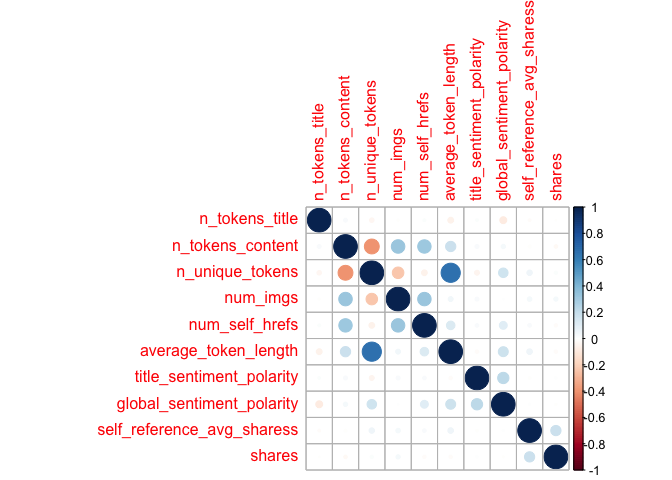

ProjectCode
================
Colleen Moore
10/8/2020

-   [\*\* Analysis for Monday \*\*](#analysis-for-monday)
    -   [Read in data](#read-in-data)
        -   [Filter for the day of the
            week](#filter-for-the-day-of-the-week)
    -   [Variable selection](#variable-selection)
        -   [Code for variable select and
            modification](#code-for-variable-select-and-modification)
        -   [Check dataset for missing
            values](#check-dataset-for-missing-values)
    -   [Create Training and Test Sets](#create-training-and-test-sets)
    -   [Summarizations](#summarizations)
        -   [Summary of all the included
            variables](#summary-of-all-the-included-variables)
        -   [Correlation plot](#correlation-plot)
        -   [Boxplots](#boxplots)
        -   [Scatterplot](#scatterplot)
    -   [Modeling](#modeling)
        -   [Tree based Model](#tree-based-model)
        -   [Boosted Tree Model](#boosted-tree-model)
    -   [Best Model](#best-model)

\*\* Analysis for Monday \*\*
=============================

Read in data
------------

    news<- read_csv("OnlineNewsPopularity.csv")

### Filter for the day of the week

    dailyNews <- filter(news, news[[paste0("weekday_is_",params$day)]] == "1")

Variable selection
------------------

The variables I chose were:

-   n\_tokens\_title: Number of words in the title  
-   n\_tokens\_content: Number of words in the content  
-   n\_unique\_tokens: Rate of unique words in the content  
-   num\_imgs: Number of images  
-   num\_self\_hrefs: Number of links to other articles published by
    Mashable  
-   average\_token\_length: Average length of the words in the content  
-   self\_reference\_avg\_sharess: Avg. shares of referenced articles in
    Mashable
-   global\_sentiment\_polarity: Text sentiment polarity
-   data\_channel - which is a derived variable from:
    -   data\_channel\_is\_lifestyle: Is data channel ‘Lifestyle’?
    -   data\_channel\_is\_entertainment: Is data channel
        ‘Entertainment’?
    -   data\_channel\_is\_bus: Is data channel ‘Business’?
    -   data\_channel\_is\_socmed: Is data channel ‘Social Media’?
    -   data\_channel\_is\_tech: Is data channel ‘Tech’?
    -   data\_channel\_is\_world: Is data channel ‘World’?
-   title\_sentiment\_polarity: Title polarity

### Code for variable select and modification

    dailyNews<- dailyNews %>% 
      mutate(channel= case_when(data_channel_is_bus == 1 ~ "Business",
                                             data_channel_is_entertainment==1 ~"Entertainment",
                                                data_channel_is_lifestyle== 1 ~ "Lifesytle",
                                                data_channel_is_socmed==1 ~ "SocialMedia",
                                                data_channel_is_tech==1 ~ "Tech",
                                                data_channel_is_world== 1 ~ "World")) %>% 
      select(n_tokens_title, n_tokens_content, n_unique_tokens, num_imgs, num_self_hrefs, 
             average_token_length, title_sentiment_polarity, global_sentiment_polarity,
             self_reference_avg_sharess, shares, channel)

### Check dataset for missing values

    miss<- dailyNews %>% summarise_all(funs(sum(is.na(.))))
    kable(miss)

<table>
<thead>
<tr>
<th style="text-align:right;">
n\_tokens\_title
</th>
<th style="text-align:right;">
n\_tokens\_content
</th>
<th style="text-align:right;">
n\_unique\_tokens
</th>
<th style="text-align:right;">
num\_imgs
</th>
<th style="text-align:right;">
num\_self\_hrefs
</th>
<th style="text-align:right;">
average\_token\_length
</th>
<th style="text-align:right;">
title\_sentiment\_polarity
</th>
<th style="text-align:right;">
global\_sentiment\_polarity
</th>
<th style="text-align:right;">
self\_reference\_avg\_sharess
</th>
<th style="text-align:right;">
shares
</th>
<th style="text-align:right;">
channel
</th>
</tr>
</thead>
<tbody>
<tr>
<td style="text-align:right;">
0
</td>
<td style="text-align:right;">
0
</td>
<td style="text-align:right;">
0
</td>
<td style="text-align:right;">
0
</td>
<td style="text-align:right;">
0
</td>
<td style="text-align:right;">
0
</td>
<td style="text-align:right;">
0
</td>
<td style="text-align:right;">
0
</td>
<td style="text-align:right;">
0
</td>
<td style="text-align:right;">
0
</td>
<td style="text-align:right;">
900
</td>
</tr>
</tbody>
</table>

Since I created a new variable channel, some news articles did not fall
into any of the listed categories and so are NA values. Replace the NA
values with “None”

    dailyNews$channel <- ifelse(is.na(dailyNews$channel), "None", dailyNews$channel)

Create Training and Test Sets
-----------------------------

Split data into training and test set- 70% of the data will be used for
training and 30% will be used for testing.

    set.seed(2011)
    train <- sample(1:nrow(dailyNews), size = nrow(dailyNews)*0.7)
    test <- setdiff(1:nrow(dailyNews), train)
    dailyNewsTrain <- dailyNews[train, ]
    dailyNewsTest <- dailyNews[test, ]

Summarizations
--------------

### Summary of all the included variables

Quick summary of all the variables in the dataset. Wanted to get an idea
of the ranges of the variables.

    kable(apply(dailyNewsTrain[1:10], 2, summary), caption = paste("Summary of Variables"), digits= 1)

<table>
<caption>
Summary of Variables
</caption>
<thead>
<tr>
<th style="text-align:left;">
</th>
<th style="text-align:right;">
n\_tokens\_title
</th>
<th style="text-align:right;">
n\_tokens\_content
</th>
<th style="text-align:right;">
n\_unique\_tokens
</th>
<th style="text-align:right;">
num\_imgs
</th>
<th style="text-align:right;">
num\_self\_hrefs
</th>
<th style="text-align:right;">
average\_token\_length
</th>
<th style="text-align:right;">
title\_sentiment\_polarity
</th>
<th style="text-align:right;">
global\_sentiment\_polarity
</th>
<th style="text-align:right;">
self\_reference\_avg\_sharess
</th>
<th style="text-align:right;">
shares
</th>
</tr>
</thead>
<tbody>
<tr>
<td style="text-align:left;">
Min.
</td>
<td style="text-align:right;">
4.0
</td>
<td style="text-align:right;">
0.0
</td>
<td style="text-align:right;">
0.0
</td>
<td style="text-align:right;">
0.0
</td>
<td style="text-align:right;">
0.0
</td>
<td style="text-align:right;">
0.0
</td>
<td style="text-align:right;">
-1.0
</td>
<td style="text-align:right;">
-0.4
</td>
<td style="text-align:right;">
0.0
</td>
<td style="text-align:right;">
43.0
</td>
</tr>
<tr>
<td style="text-align:left;">
1st Qu.
</td>
<td style="text-align:right;">
9.0
</td>
<td style="text-align:right;">
248.0
</td>
<td style="text-align:right;">
0.5
</td>
<td style="text-align:right;">
1.0
</td>
<td style="text-align:right;">
1.0
</td>
<td style="text-align:right;">
4.5
</td>
<td style="text-align:right;">
0.0
</td>
<td style="text-align:right;">
0.1
</td>
<td style="text-align:right;">
1000.6
</td>
<td style="text-align:right;">
920.0
</td>
</tr>
<tr>
<td style="text-align:left;">
Median
</td>
<td style="text-align:right;">
10.0
</td>
<td style="text-align:right;">
400.5
</td>
<td style="text-align:right;">
0.5
</td>
<td style="text-align:right;">
1.0
</td>
<td style="text-align:right;">
3.0
</td>
<td style="text-align:right;">
4.7
</td>
<td style="text-align:right;">
0.0
</td>
<td style="text-align:right;">
0.1
</td>
<td style="text-align:right;">
2155.0
</td>
<td style="text-align:right;">
1400.0
</td>
</tr>
<tr>
<td style="text-align:left;">
Mean
</td>
<td style="text-align:right;">
10.4
</td>
<td style="text-align:right;">
543.1
</td>
<td style="text-align:right;">
0.5
</td>
<td style="text-align:right;">
4.4
</td>
<td style="text-align:right;">
3.4
</td>
<td style="text-align:right;">
4.5
</td>
<td style="text-align:right;">
0.1
</td>
<td style="text-align:right;">
0.1
</td>
<td style="text-align:right;">
6128.1
</td>
<td style="text-align:right;">
3658.4
</td>
</tr>
<tr>
<td style="text-align:left;">
3rd Qu.
</td>
<td style="text-align:right;">
12.0
</td>
<td style="text-align:right;">
718.0
</td>
<td style="text-align:right;">
0.6
</td>
<td style="text-align:right;">
3.0
</td>
<td style="text-align:right;">
4.0
</td>
<td style="text-align:right;">
4.8
</td>
<td style="text-align:right;">
0.1
</td>
<td style="text-align:right;">
0.2
</td>
<td style="text-align:right;">
5155.5
</td>
<td style="text-align:right;">
2800.0
</td>
</tr>
<tr>
<td style="text-align:left;">
Max.
</td>
<td style="text-align:right;">
18.0
</td>
<td style="text-align:right;">
7764.0
</td>
<td style="text-align:right;">
0.9
</td>
<td style="text-align:right;">
93.0
</td>
<td style="text-align:right;">
51.0
</td>
<td style="text-align:right;">
6.2
</td>
<td style="text-align:right;">
1.0
</td>
<td style="text-align:right;">
0.6
</td>
<td style="text-align:right;">
663600.0
</td>
<td style="text-align:right;">
652900.0
</td>
</tr>
</tbody>
</table>

### Correlation plot

Correlation plot of variable choosen to be included in model. Seeing if
any of the chosen variables are highly correlated with the response
variable shares or among each other.

    correlation <- dailyNewsTrain %>% keep(is.numeric) %>% cor()
    corrplot(correlation)

<!-- -->

None of the variables appear to have a high correlation with the shares
variable.

### Boxplots

Boxplots of all the variables to be used in the model to get an idea of
shape and if outliers are present.

    dailyNewsTrain %>%
    keep(is.numeric) %>%
    pivot_longer(everything()) %>%
    ggplot(aes(x = value)) +
    facet_wrap(~ name, scales = "free") +
    geom_boxplot()

<!-- -->

### Scatterplot

Below is a plot of self\_reference\_avg\_sharess (Avg. shares of
referenced articles in Mashable) and shares category.

    ggplot(dailyNewsTrain, aes(self_reference_avg_sharess,shares))+ 
      geom_point()+ geom_jitter() + 
      labs(x= "Number of links to other articles", y= "Number of times shared category", 
           title= "Links and Number of Times Shared")

<!-- -->

Modeling
--------

### Tree based Model

The first model is a classification tree-based model (not ensemble)
using leave one out cross validation. I will be using rpart from the
`caret` package for this tree.

    Tree_fit<- train(shares ~.,  data= dailyNewsTrain, method= "rpart",
                     trControl=trainControl(method = "LOOCV"),
                    preProcess = c("center", "scale"))

    Tree_fit

    ## CART 
    ## 
    ## 4662 samples
    ##   10 predictor
    ## 
    ## Pre-processing: centered (15), scaled (15) 
    ## Resampling: Leave-One-Out Cross-Validation 
    ## Summary of sample sizes: 4661, 4661, 4661, 4661, 4661, 4661, ... 
    ## Resampling results across tuning parameters:
    ## 
    ##   cp           RMSE      Rsquared      MAE     
    ##   0.007851814  13808.63  0.0005795357  3804.466
    ##   0.010464875  13731.43  0.0007099540  4116.339
    ##   0.072623370  13572.29  0.0001591796  3808.197
    ## 
    ## RMSE was used to select the optimal model using the smallest value.
    ## The final value used for the model was cp = 0.07262337.

Test the tree based model on the test data set.

    pred_Tree_fit<- predict(Tree_fit, newdata= dailyNewsTest)
    modelA<- postResample(pred_Tree_fit, obs= dailyNewsTest$shares)
    modelA

    ##      RMSE  Rsquared       MAE 
    ## 17688.925        NA  3720.629

### Boosted Tree Model

The next model is a classification boosted tree model with parameters
choosen using cross validation. I chose the Stochastic Gradient Boosting
method (gbm method).

    fit_control <- trainControl(method="cv", number=10)

    grid <- expand.grid(n.trees=c(25, 50, 100, 200,500), shrinkage=c(0.05, 0.1, 0.15),
                        n.minobsinnode = c(5,10, 15),interaction.depth=1)

    boostedTree <-train(shares ~ ., data= dailyNewsTrain, method='gbm',
                        trControl=fit_control, tuneGrid=grid, verbose= FALSE)

    boostedTree

    ## Stochastic Gradient Boosting 
    ## 
    ## 4662 samples
    ##   10 predictor
    ## 
    ## No pre-processing
    ## Resampling: Cross-Validated (10 fold) 
    ## Summary of sample sizes: 4196, 4196, 4197, 4196, 4195, 4195, ... 
    ## Resampling results across tuning parameters:
    ## 
    ##   shrinkage  n.minobsinnode  n.trees  RMSE      Rsquared     MAE     
    ##   0.05        5               25      11306.43  0.009548767  3683.251
    ##   0.05        5               50      11465.27  0.006177394  3673.026
    ##   0.05        5              100      11628.42  0.004460427  3682.743
    ##   0.05        5              200      11776.21  0.009205706  3691.896
    ##   0.05        5              500      11795.97  0.010155037  3672.855
    ##   0.05       10               25      11113.25  0.006856336  3654.638
    ##   0.05       10               50      11108.88  0.006721889  3629.679
    ##   0.05       10              100      11255.76  0.006565802  3655.367
    ##   0.05       10              200      11235.11  0.009487759  3627.076
    ##   0.05       10              500      11239.84  0.008687404  3628.911
    ##   0.05       15               25      11053.12  0.005194568  3633.834
    ##   0.05       15               50      11102.08  0.005243815  3636.381
    ##   0.05       15              100      11119.89  0.005532146  3633.786
    ##   0.05       15              200      11119.77  0.006346887  3624.237
    ##   0.05       15              500      11144.11  0.006891296  3621.325
    ##   0.10        5               25      11566.59  0.005594807  3693.549
    ##   0.10        5               50      11964.40  0.004504911  3732.369
    ##   0.10        5              100      11689.33  0.006054402  3680.709
    ##   0.10        5              200      11658.04  0.009073690  3655.943
    ##   0.10        5              500      12034.30  0.009822237  3686.523
    ##   0.10       10               25      11167.70  0.005914752  3644.409
    ##   0.10       10               50      11174.28  0.010532155  3634.275
    ##   0.10       10              100      11236.87  0.007068579  3642.236
    ##   0.10       10              200      11323.24  0.008372805  3638.374
    ##   0.10       10              500      11380.31  0.010078521  3641.033
    ##   0.10       15               25      11098.62  0.005719787  3638.276
    ##   0.10       15               50      11099.86  0.005931323  3613.499
    ##   0.10       15              100      11116.66  0.007762965  3619.135
    ##   0.10       15              200      11136.08  0.009554291  3611.574
    ##   0.10       15              500      11182.61  0.010474208  3639.273
    ##   0.15        5               25      11456.44  0.011638366  3651.886
    ##   0.15        5               50      11730.91  0.007688679  3687.576
    ##   0.15        5              100      11751.42  0.006418275  3669.410
    ##   0.15        5              200      11945.12  0.006767207  3679.386
    ##   0.15        5              500      12528.04  0.009388262  3746.030
    ##   0.15       10               25      11202.68  0.004888513  3660.498
    ##   0.15       10               50      11346.99  0.006872554  3662.580
    ##   0.15       10              100      11323.51  0.007561512  3649.748
    ##   0.15       10              200      11158.06  0.009222049  3591.745
    ##   0.15       10              500      11395.84  0.010889668  3650.100
    ##   0.15       15               25      11092.28  0.006868516  3617.873
    ##   0.15       15               50      11150.95  0.008136940  3617.036
    ##   0.15       15              100      11120.36  0.008155577  3610.792
    ##   0.15       15              200      11150.82  0.010029291  3634.951
    ##   0.15       15              500      11213.60  0.011298691  3642.626
    ## 
    ## Tuning parameter 'interaction.depth' was held constant at a value of 1
    ## RMSE was used to select the optimal model using the smallest value.
    ## The final values used for the model were n.trees = 25, interaction.depth =
    ##  1, shrinkage = 0.05 and n.minobsinnode = 15.

Test the model on the test dataset.

    pred_boostedTree<- predict(boostedTree, newdata= dailyNewsTest)
    modelB<- postResample(pred_boostedTree, obs= dailyNewsTest$shares)
    modelB

    ##         RMSE     Rsquared          MAE 
    ## 1.772369e+04 5.283780e-04 3.726391e+03

Best Model
----------

Out of the two models, the one with the lowest RMSE of 1.7688925^{4} was
the tree based model
