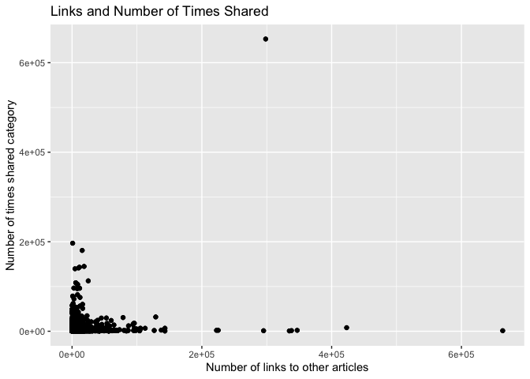

ProjectCode
================
Colleen Moore
10/8/2020

-   [Variable selection](#variable-selection)
-   [Create Training and Test Sets](#create-training-and-test-sets)
-   [Summarizations](#summarizations)
-   [Modeling](#modeling)
    -   [Tree based Model](#tree-based-model)
    -   [Boosted Tree Model](#boosted-tree-model)

*This analysis is for Monday*

Read in data

    news<- read_csv("OnlineNewsPopularity.csv")

    ## Parsed with column specification:
    ## cols(
    ##   .default = col_double(),
    ##   url = col_character()
    ## )

    ## See spec(...) for full column specifications.

Filter for the day of the week

    dailyNews <- filter(news, news[[paste0("weekday_is_",params$day)]] == "1")

### Variable selection

    dailyNews<- dailyNews %>% 
      mutate(channel= case_when(data_channel_is_bus == 1 ~ "Business",
                                             data_channel_is_entertainment==1 ~"Entertainment",
                                                data_channel_is_lifestyle== 1 ~ "Lifesytle",
                                                data_channel_is_socmed==1 ~ "SocialMedia",
                                                data_channel_is_tech==1 ~ "Tech",
                                                data_channel_is_world== 1 ~ "World")) %>% select(n_tokens_title, n_tokens_content, n_unique_tokens, num_imgs, num_self_hrefs, average_token_length, title_sentiment_polarity, global_sentiment_polarity, shares, channel)

Check dataset for missing values

    dailyNews %>% summarise_all(funs(sum(is.na(.))))

    ## Warning: `funs()` is deprecated as of dplyr 0.8.0.
    ## Please use a list of either functions or lambdas: 
    ## 
    ##   # Simple named list: 
    ##   list(mean = mean, median = median)
    ## 
    ##   # Auto named with `tibble::lst()`: 
    ##   tibble::lst(mean, median)
    ## 
    ##   # Using lambdas
    ##   list(~ mean(., trim = .2), ~ median(., na.rm = TRUE))
    ## This warning is displayed once every 8 hours.
    ## Call `lifecycle::last_warnings()` to see where this warning was generated.

    ## # A tibble: 1 x 10
    ##   n_tokens_title n_tokens_content n_unique_tokens num_imgs num_self_hrefs
    ##            <int>            <int>           <int>    <int>          <int>
    ## 1              0                0               0        0              0
    ## # … with 5 more variables: average_token_length <int>,
    ## #   title_sentiment_polarity <int>, global_sentiment_polarity <int>,
    ## #   shares <int>, channel <int>

Since I created a new variable channel, some news articles did not fall
into any of the listed categories and so are NA values. Replace the NA
values with “None”

    dailyNews$channel <- ifelse(is.na(dailyNews$channel), "None", dailyNews$channel)

Create Training and Test Sets
-----------------------------

Split data into training and test set- 70% of the data will be used for
training and 30% will be used for testing.

    set.seed(2011)
    train <- sample(1:nrow(dailyNews), size = nrow(dailyNews)*0.7)
    test <- setdiff(1:nrow(dailyNews), train)
    dailyNewsTrain <- dailyNews[train, ]
    dailyNewsTest <- dailyNews[test, ]

Summarizations
--------------

Quick summary of all the variables in the dataset. Wanted to get an idea
of the ranges of the variables.

    kable(apply(dailyNewsTrain[1:9], 2, summary), caption = paste("Summary of Variables"), digits= 1)

<table>
<caption>
Summary of Variables
</caption>
<thead>
<tr>
<th style="text-align:left;">
</th>
<th style="text-align:right;">
n\_tokens\_title
</th>
<th style="text-align:right;">
n\_tokens\_content
</th>
<th style="text-align:right;">
n\_unique\_tokens
</th>
<th style="text-align:right;">
num\_imgs
</th>
<th style="text-align:right;">
num\_self\_hrefs
</th>
<th style="text-align:right;">
average\_token\_length
</th>
<th style="text-align:right;">
title\_sentiment\_polarity
</th>
<th style="text-align:right;">
global\_sentiment\_polarity
</th>
<th style="text-align:right;">
shares
</th>
</tr>
</thead>
<tbody>
<tr>
<td style="text-align:left;">
Min.
</td>
<td style="text-align:right;">
4.0
</td>
<td style="text-align:right;">
0.0
</td>
<td style="text-align:right;">
0.0
</td>
<td style="text-align:right;">
0.0
</td>
<td style="text-align:right;">
0.0
</td>
<td style="text-align:right;">
0.0
</td>
<td style="text-align:right;">
-1.0
</td>
<td style="text-align:right;">
-0.4
</td>
<td style="text-align:right;">
43.0
</td>
</tr>
<tr>
<td style="text-align:left;">
1st Qu.
</td>
<td style="text-align:right;">
9.0
</td>
<td style="text-align:right;">
248.0
</td>
<td style="text-align:right;">
0.5
</td>
<td style="text-align:right;">
1.0
</td>
<td style="text-align:right;">
1.0
</td>
<td style="text-align:right;">
4.5
</td>
<td style="text-align:right;">
0.0
</td>
<td style="text-align:right;">
0.1
</td>
<td style="text-align:right;">
920.0
</td>
</tr>
<tr>
<td style="text-align:left;">
Median
</td>
<td style="text-align:right;">
10.0
</td>
<td style="text-align:right;">
400.5
</td>
<td style="text-align:right;">
0.5
</td>
<td style="text-align:right;">
1.0
</td>
<td style="text-align:right;">
3.0
</td>
<td style="text-align:right;">
4.7
</td>
<td style="text-align:right;">
0.0
</td>
<td style="text-align:right;">
0.1
</td>
<td style="text-align:right;">
1400.0
</td>
</tr>
<tr>
<td style="text-align:left;">
Mean
</td>
<td style="text-align:right;">
10.4
</td>
<td style="text-align:right;">
543.1
</td>
<td style="text-align:right;">
0.5
</td>
<td style="text-align:right;">
4.4
</td>
<td style="text-align:right;">
3.4
</td>
<td style="text-align:right;">
4.5
</td>
<td style="text-align:right;">
0.1
</td>
<td style="text-align:right;">
0.1
</td>
<td style="text-align:right;">
3658.4
</td>
</tr>
<tr>
<td style="text-align:left;">
3rd Qu.
</td>
<td style="text-align:right;">
12.0
</td>
<td style="text-align:right;">
718.0
</td>
<td style="text-align:right;">
0.6
</td>
<td style="text-align:right;">
3.0
</td>
<td style="text-align:right;">
4.0
</td>
<td style="text-align:right;">
4.8
</td>
<td style="text-align:right;">
0.1
</td>
<td style="text-align:right;">
0.2
</td>
<td style="text-align:right;">
2800.0
</td>
</tr>
<tr>
<td style="text-align:left;">
Max.
</td>
<td style="text-align:right;">
18.0
</td>
<td style="text-align:right;">
7764.0
</td>
<td style="text-align:right;">
0.9
</td>
<td style="text-align:right;">
93.0
</td>
<td style="text-align:right;">
51.0
</td>
<td style="text-align:right;">
6.2
</td>
<td style="text-align:right;">
1.0
</td>
<td style="text-align:right;">
0.6
</td>
<td style="text-align:right;">
652900.0
</td>
</tr>
</tbody>
</table>

Correlation plot of variable choosen to be included in model. seeing if
any of the chosen variables are highly correlated with the response
variable shares or among each other.

    correlation <- dailyNewsTrain %>% keep(is.numeric) %>% cor()
    corrplot(correlation)

<!-- -->

Boxplots of all the variables to be used in the model to get an idea of
shape and if outliers are present.

    dailyNewsTrain %>%
    keep(is.numeric) %>%
    pivot_longer(everything()) %>%
    ggplot(aes(x = value)) +
    facet_wrap(~ name, scales = "free") +
    geom_boxplot()

<!-- -->

None of the variables appear to have a high correlation with the shares
variable. Below is a plot of number of links of other articles and
shares category.

    ggplot(dailyNewsTrain, aes(num_self_hrefs, shares))+ geom_point()+ geom_jitter() + labs(x= "Number of links to other articles", y= "Number of times shared category", title= "Links and Number of Times Shared")

<!-- -->

Modeling
--------

### Tree based Model

The first model is a classification tree-based model (not ensemble)
using leave one out cross validation. I will be using rpart from the
`caret` package for this tree.

    Tree_fit<- train(shares ~.,  data= dailyNewsTrain, method= "rpart",
                     trControl=trainControl(method = "LOOCV"),
                    preProcess = c("center", "scale"))

    Tree_fit

    ## CART 
    ## 
    ## 4662 samples
    ##    9 predictor
    ## 
    ## Pre-processing: centered (14), scaled (14) 
    ## Resampling: Leave-One-Out Cross-Validation 
    ## Summary of sample sizes: 4661, 4661, 4661, 4661, 4661, 4661, ... 
    ## Resampling results across tuning parameters:
    ## 
    ##   cp           RMSE      Rsquared      MAE     
    ##   0.005419217  13884.86  0.0004477767  3785.074
    ##   0.006481229  13746.63  0.0005512005  3735.401
    ##   0.028338093  13444.46  0.0009034610  4127.788
    ## 
    ## RMSE was used to select the optimal model using the smallest value.
    ## The final value used for the model was cp = 0.02833809.

See how this model did on the training dataset

    pred_Tree_fit<- predict(Tree_fit, newdata= dailyNewsTest)
    modelA<- postResample(pred_Tree_fit, obs= dailyNewsTest$shares)
    modelA

    ##      RMSE  Rsquared       MAE 
    ## 17688.925        NA  3720.629

### Boosted Tree Model

The next model is a classification boosted tree model with parameters
choosen using cross validation. I chose the Stochastic Gradient Boosting
method (gbm method).

    fit_control <- trainControl(method="cv", number=10)

    grid <- expand.grid(n.trees=c(25, 50, 100, 200,500), shrinkage=c(0.05, 0.1, 0.15),
                        n.minobsinnode = c(5,10, 15),interaction.depth=1)

    boostedTree <-train(shares ~ ., data= dailyNewsTrain, method='gbm', trControl=fit_control, tuneGrid=grid, verbose= FALSE)

    boostedTree

    ## Stochastic Gradient Boosting 
    ## 
    ## 4662 samples
    ##    9 predictor
    ## 
    ## No pre-processing
    ## Resampling: Cross-Validated (10 fold) 
    ## Summary of sample sizes: 4196, 4196, 4197, 4196, 4195, 4195, ... 
    ## Resampling results across tuning parameters:
    ## 
    ##   shrinkage  n.minobsinnode  n.trees  RMSE      Rsquared     MAE     
    ##   0.05        5               25      10969.24  0.009570571  3638.007
    ##   0.05        5               50      10961.19  0.013010295  3612.960
    ##   0.05        5              100      10965.23  0.014243304  3619.262
    ##   0.05        5              200      10970.85  0.015169181  3619.466
    ##   0.05        5              500      10995.16  0.014391239  3626.571
    ##   0.05       10               25      10957.68  0.012841557  3631.441
    ##   0.05       10               50      10954.36  0.014661911  3607.673
    ##   0.05       10              100      10959.95  0.015306787  3622.785
    ##   0.05       10              200      10967.11  0.015276770  3615.521
    ##   0.05       10              500      10991.52  0.014637333  3635.747
    ##   0.05       15               25      10959.62  0.012002216  3617.296
    ##   0.05       15               50      10965.37  0.011954260  3622.520
    ##   0.05       15              100      10966.91  0.014113828  3617.189
    ##   0.05       15              200      10975.73  0.014372560  3618.172
    ##   0.05       15              500      10988.34  0.014436621  3631.348
    ##   0.10        5               25      10971.38  0.011714465  3620.831
    ##   0.10        5               50      10971.26  0.013199821  3639.508
    ##   0.10        5              100      10962.85  0.015989878  3618.943
    ##   0.10        5              200      10985.32  0.015369539  3630.115
    ##   0.10        5              500      11028.46  0.013658091  3647.999
    ##   0.10       10               25      10959.32  0.013591383  3611.724
    ##   0.10       10               50      10959.92  0.016194665  3613.836
    ##   0.10       10              100      10962.83  0.016235769  3621.923
    ##   0.10       10              200      10984.45  0.015329784  3624.886
    ##   0.10       10              500      11040.57  0.013442480  3654.251
    ##   0.10       15               25      10951.90  0.015212350  3613.953
    ##   0.10       15               50      10961.69  0.015250428  3603.817
    ##   0.10       15              100      10969.83  0.016299802  3614.331
    ##   0.10       15              200      10985.66  0.015117189  3623.931
    ##   0.10       15              500      11032.43  0.013016512  3648.394
    ##   0.15        5               25      10962.95  0.015159055  3606.238
    ##   0.15        5               50      10974.17  0.015304343  3623.031
    ##   0.15        5              100      10981.15  0.014804415  3625.494
    ##   0.15        5              200      11013.20  0.012779687  3639.059
    ##   0.15        5              500      11096.43  0.010460677  3664.589
    ##   0.15       10               25      10967.47  0.013104904  3636.317
    ##   0.15       10               50      10971.02  0.015781359  3627.280
    ##   0.15       10              100      10975.65  0.016900192  3638.791
    ##   0.15       10              200      10992.72  0.015722455  3617.244
    ##   0.15       10              500      11092.21  0.012265779  3654.254
    ##   0.15       15               25      10960.96  0.014336131  3614.705
    ##   0.15       15               50      10975.50  0.013556467  3624.880
    ##   0.15       15              100      10987.44  0.013069625  3622.291
    ##   0.15       15              200      11002.77  0.012843338  3637.629
    ##   0.15       15              500      11098.71  0.010295665  3657.074
    ## 
    ## Tuning parameter 'interaction.depth' was held constant at a value of 1
    ## RMSE was used to select the optimal model using the smallest value.
    ## The final values used for the model were n.trees = 25, interaction.depth =
    ##  1, shrinkage = 0.1 and n.minobsinnode = 15.

Test the model on the test dataset.

    pred_boostedTree<- predict(boostedTree, newdata= dailyNewsTest)
    modelB<- postResample(pred_boostedTree, obs= dailyNewsTest$shares)
    modelB

    ##         RMSE     Rsquared          MAE 
    ## 1.764765e+04 4.672056e-03 3.686885e+03

Out of the two models, the one with the lowest RMSE of 1.7647648^{4} was
the boosted tree model
