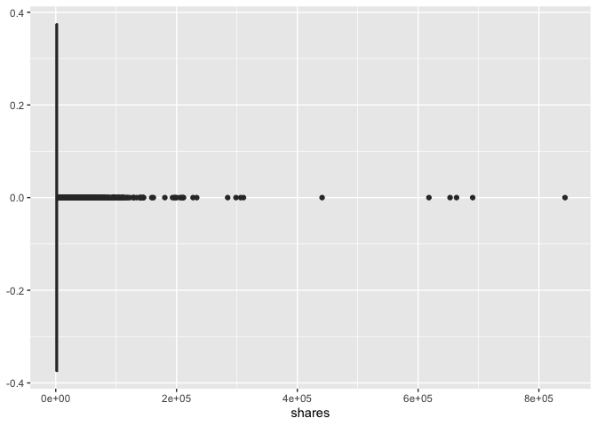

Automation
================
Colleen Moore
10/8/2020

-   [Packages](#packages)
-   [Introduction](#introduction)
-   [Read in the data](#read-in-the-data)
-   [Code for automation of Daily
    Reports](#code-for-automation-of-daily-reports)
-   [Daily Analysis](#daily-analysis)

Packages
--------

The packages required to run my this project are `tidyverse`, `caret`,
`rmarkdown`, `corrplot`, `kableExtra`, and `Hmisc`.

Introduction
------------

The data for this project is an online news popularity data set that can
be found
[here](https://archive.ics.uci.edu/ml/datasets/Online+News+Popularity#).
The dataset contains 58 predictive attributes including such things as
number of words in the title, or attributes related to what channel the
article was found on. One of the goals of the project is to create
models to predict the shares variable, which is the number of times the
article has been shared. Another goal of the project is to automate the
markdown reports for each day of the week.

For the model building, the variables that I think are important
include:

-   n\_tokens\_title: Number of words in the title  
-   n\_tokens\_content: Number of words in the content  
-   n\_unique\_tokens: Rate of unique words in the content  
-   num\_imgs: Number of images  
-   num\_self\_hrefs: Number of links to other articles published by
    Mashable  
-   average\_token\_length: Average length of the words in the content  
-   self\_reference\_avg\_sharess: Avg. shares of referenced articles in
    Mashable
-   global\_sentiment\_polarity: Text sentiment polarity
-   data\_channel - which is a derived variable from:
    -   data\_channel\_is\_lifestyle: Is data channel ‘Lifestyle’?
    -   data\_channel\_is\_entertainment: Is data channel
        ‘Entertainment’?
    -   data\_channel\_is\_bus: Is data channel ‘Business’?
    -   data\_channel\_is\_socmed: Is data channel ‘Social Media’?
    -   data\_channel\_is\_tech: Is data channel ‘Tech’?
    -   data\_channel\_is\_world: Is data channel ‘World’?
-   title\_sentiment\_polarity: Title polarity

We are asked to build a tree- based model using leave one out cross
validation and a boosted tree model using cross validation.

I will be using `rpart` from the `caret` package to produce my tree
model. I thought about doing a classification model but left it as a
regression model since we did an example of a classification model in
class. The optimization parameter in this model is `cp` or the
Complexity Parameter which will be found using leave one out cross
validation. Leave one out cross validation (LOOCV) is a special type of
cross validation in which the number of folds is equal to the number of
instances in the dataset. So for example if there are 10 observations in
the dataset, then the `cp` would be based on 9 observations and used to
test on the 10th. Our dataset has quite a few observations and so this
model takes a long time to run.

This tree model is like a decision tree model that can easily be built
in excel for example. It uses a series of if-then rules to generate
predictions. When doing this type of tree in the `caret` package, the
tree is automatically pruned for us. The advantages of this type of
model is that it is easy to understand and interpret.

For the boosted tree model, I will be again using the `caret` package to
produce this model. I will be using the Stochastic Gradient Boosting
Model (gbm). The optimization parameters for this model are n. tree (the
number of trees), interaction.depth (max tree depth), shrinkage
(learning rate), and n.minobsinnode (min. terminal node size). These 4
parameters will be optimizaed usign cross validation. The idea behind
the boosted tree model is that the trees are grown sequentially, and
each subsequent tree tries to minimize the errors of the previous tree.
Each tree is relatively weak but adding them together in series can
produce an effective model.

I would expect the boosted tree model to perform better for all the
predictions.

Read in the data
----------------

To get an idea of the data I will be working with.

    news<- read_csv("OnlineNewsPopularity.csv")

Our target variable is shares. Below is the distribution of shares.

    ggplot(news, aes(shares))+ geom_boxplot()

<!-- -->

    summary(news$shares)

    ##    Min. 1st Qu.  Median    Mean 3rd Qu.    Max. 
    ##       1     946    1400    3395    2800  843300

There is a very wide range of number of times an article has been shared
in the dataset.

Code for automation of Daily Reports
------------------------------------

Below is the code to automate the process of making reports for each day
of the week.

    days <- c("monday", "tuesday", "wednesday",
              "thursday", "friday", "saturday",
               "sunday")

    #create file names
    output_file <- paste0(capitalize(days), "Analysis.md")

    #create a list for each day of the week
    params <- lapply(days, FUN = function(x){list(day = x)})

    #put this list into data frame
    reports <- tibble(filename = output_file, params)

Use the apply & render function to create each of the 7 reports

    apply(reports, MARGIN = 1, FUN = function(x){
      render("ProjectCode.Rmd", 
             output_file = x[[1]], params = x[[2]])
    })

Daily Analysis
--------------

Below are the reports for each day of the week:

-   [Monday’s Report](MondayAnalysis.md)  
-   [Tuesday’s Report](TuesdayAnalysis.md)  
-   [Wednesday’s Report](WednesdayAnalysis.md)  
-   [Thursday’s Report](ThursdayAnalysis.md)  
-   [Friday’s Report](FridayAnalysis.md)  
-   [Saturday’s Report](SaturdayAnalysis.md)  
-   [Sunday’s Report](SundayAnalysis.md)
