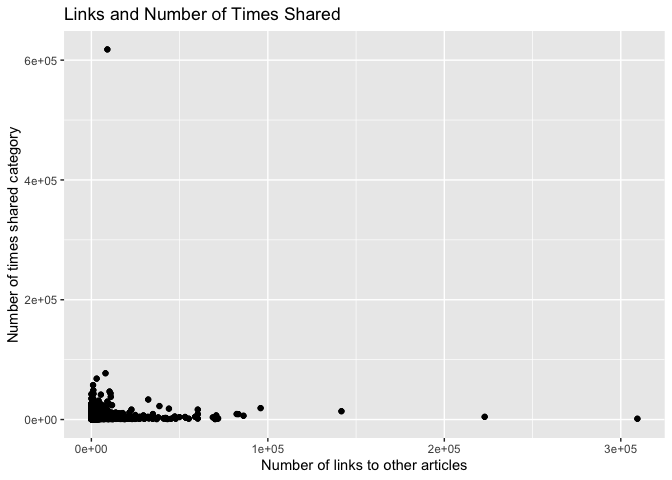

ProjectCode
================
Colleen Moore
10/8/2020

-   [\*\* Analysis for Saturday \*\*](#analysis-for-saturday)
    -   [Read in data](#read-in-data)
        -   [Filter for the day of the
            week](#filter-for-the-day-of-the-week)
    -   [Variable selection](#variable-selection)
        -   [Code for variable select and
            modification](#code-for-variable-select-and-modification)
        -   [Check dataset for missing
            values](#check-dataset-for-missing-values)
    -   [Create Training and Test Sets](#create-training-and-test-sets)
    -   [Summarizations](#summarizations)
        -   [Summary of all the included
            variables](#summary-of-all-the-included-variables)
        -   [Correlation plot](#correlation-plot)
        -   [Boxplots](#boxplots)
        -   [Scatterplot](#scatterplot)
    -   [Modeling](#modeling)
        -   [Tree based Model](#tree-based-model)
        -   [Boosted Tree Model](#boosted-tree-model)
    -   [Part 2 - Laura Mathews](#part-2---laura-mathews)
    -   [Best Model](#best-model)

\*\* Analysis for Saturday \*\*
===============================

Read in data
------------

    news<- read_csv("OnlineNewsPopularity.csv")

### Filter for the day of the week

    dailyNews <- filter(news, news[[paste0("weekday_is_",params$day)]] == "1")

Variable selection
------------------

The variables I chose were:

-   n\_tokens\_title: Number of words in the title  
-   n\_tokens\_content: Number of words in the content  
-   n\_unique\_tokens: Rate of unique words in the content  
-   num\_imgs: Number of images  
-   num\_self\_hrefs: Number of links to other articles published by
    Mashable  
-   average\_token\_length: Average length of the words in the content  
-   self\_reference\_avg\_sharess: Avg. shares of referenced articles in
    Mashable
-   global\_sentiment\_polarity: Text sentiment polarity
-   data\_channel - which is a derived variable from:
    -   data\_channel\_is\_lifestyle: Is data channel ‘Lifestyle’?
    -   data\_channel\_is\_entertainment: Is data channel
        ‘Entertainment’?
    -   data\_channel\_is\_bus: Is data channel ‘Business’?
    -   data\_channel\_is\_socmed: Is data channel ‘Social Media’?
    -   data\_channel\_is\_tech: Is data channel ‘Tech’?
    -   data\_channel\_is\_world: Is data channel ‘World’?
-   title\_sentiment\_polarity: Title polarity

### Code for variable select and modification

    dailyNews<- dailyNews %>% 
      mutate(channel= case_when(data_channel_is_bus == 1 ~ "Business",
                                             data_channel_is_entertainment==1 ~"Entertainment",
                                                data_channel_is_lifestyle== 1 ~ "Lifesytle",
                                                data_channel_is_socmed==1 ~ "SocialMedia",
                                                data_channel_is_tech==1 ~ "Tech",
                                                data_channel_is_world== 1 ~ "World")) %>% 
      select(n_tokens_title, n_tokens_content, n_unique_tokens, num_imgs, num_self_hrefs, 
             average_token_length, title_sentiment_polarity, global_sentiment_polarity,
             self_reference_avg_sharess, shares, channel)

### Check dataset for missing values

    miss<- dailyNews %>% summarise_all(funs(sum(is.na(.))))
    kable(miss)

<table>
<thead>
<tr>
<th style="text-align:right;">
n\_tokens\_title
</th>
<th style="text-align:right;">
n\_tokens\_content
</th>
<th style="text-align:right;">
n\_unique\_tokens
</th>
<th style="text-align:right;">
num\_imgs
</th>
<th style="text-align:right;">
num\_self\_hrefs
</th>
<th style="text-align:right;">
average\_token\_length
</th>
<th style="text-align:right;">
title\_sentiment\_polarity
</th>
<th style="text-align:right;">
global\_sentiment\_polarity
</th>
<th style="text-align:right;">
self\_reference\_avg\_sharess
</th>
<th style="text-align:right;">
shares
</th>
<th style="text-align:right;">
channel
</th>
</tr>
</thead>
<tbody>
<tr>
<td style="text-align:right;">
0
</td>
<td style="text-align:right;">
0
</td>
<td style="text-align:right;">
0
</td>
<td style="text-align:right;">
0
</td>
<td style="text-align:right;">
0
</td>
<td style="text-align:right;">
0
</td>
<td style="text-align:right;">
0
</td>
<td style="text-align:right;">
0
</td>
<td style="text-align:right;">
0
</td>
<td style="text-align:right;">
0
</td>
<td style="text-align:right;">
424
</td>
</tr>
</tbody>
</table>

Since I created a new variable channel, some news articles did not fall
into any of the listed categories and so are NA values. Replace the NA
values with “None”

    dailyNews$channel <- ifelse(is.na(dailyNews$channel), "None", dailyNews$channel)

Create Training and Test Sets
-----------------------------

Split data into training and test set- 70% of the data will be used for
training and 30% will be used for testing.

    set.seed(2011)
    train <- sample(1:nrow(dailyNews), size = nrow(dailyNews)*0.7)
    test <- setdiff(1:nrow(dailyNews), train)
    dailyNewsTrain <- dailyNews[train, ]
    dailyNewsTest <- dailyNews[test, ]

Summarizations
--------------

### Summary of all the included variables

Quick summary of all the variables in the dataset. Wanted to get an idea
of the ranges of the variables.

    kable(apply(dailyNewsTrain[1:10], 2, summary), caption = paste("Summary of Variables"), digits= 1)

<table>
<caption>
Summary of Variables
</caption>
<thead>
<tr>
<th style="text-align:left;">
</th>
<th style="text-align:right;">
n\_tokens\_title
</th>
<th style="text-align:right;">
n\_tokens\_content
</th>
<th style="text-align:right;">
n\_unique\_tokens
</th>
<th style="text-align:right;">
num\_imgs
</th>
<th style="text-align:right;">
num\_self\_hrefs
</th>
<th style="text-align:right;">
average\_token\_length
</th>
<th style="text-align:right;">
title\_sentiment\_polarity
</th>
<th style="text-align:right;">
global\_sentiment\_polarity
</th>
<th style="text-align:right;">
self\_reference\_avg\_sharess
</th>
<th style="text-align:right;">
shares
</th>
</tr>
</thead>
<tbody>
<tr>
<td style="text-align:left;">
Min.
</td>
<td style="text-align:right;">
5.0
</td>
<td style="text-align:right;">
0.0
</td>
<td style="text-align:right;">
0.0
</td>
<td style="text-align:right;">
0.0
</td>
<td style="text-align:right;">
0.0
</td>
<td style="text-align:right;">
0.0
</td>
<td style="text-align:right;">
-1.0
</td>
<td style="text-align:right;">
-0.3
</td>
<td style="text-align:right;">
0.0
</td>
<td style="text-align:right;">
49.0
</td>
</tr>
<tr>
<td style="text-align:left;">
1st Qu.
</td>
<td style="text-align:right;">
9.0
</td>
<td style="text-align:right;">
277.0
</td>
<td style="text-align:right;">
0.5
</td>
<td style="text-align:right;">
1.0
</td>
<td style="text-align:right;">
1.0
</td>
<td style="text-align:right;">
4.5
</td>
<td style="text-align:right;">
0.0
</td>
<td style="text-align:right;">
0.1
</td>
<td style="text-align:right;">
1000.0
</td>
<td style="text-align:right;">
1300.0
</td>
</tr>
<tr>
<td style="text-align:left;">
Median
</td>
<td style="text-align:right;">
10.0
</td>
<td style="text-align:right;">
506.0
</td>
<td style="text-align:right;">
0.5
</td>
<td style="text-align:right;">
1.0
</td>
<td style="text-align:right;">
3.0
</td>
<td style="text-align:right;">
4.7
</td>
<td style="text-align:right;">
0.0
</td>
<td style="text-align:right;">
0.1
</td>
<td style="text-align:right;">
2340.0
</td>
<td style="text-align:right;">
2000.0
</td>
</tr>
<tr>
<td style="text-align:left;">
Mean
</td>
<td style="text-align:right;">
10.3
</td>
<td style="text-align:right;">
602.3
</td>
<td style="text-align:right;">
0.5
</td>
<td style="text-align:right;">
5.4
</td>
<td style="text-align:right;">
3.9
</td>
<td style="text-align:right;">
4.5
</td>
<td style="text-align:right;">
0.1
</td>
<td style="text-align:right;">
0.1
</td>
<td style="text-align:right;">
5358.3
</td>
<td style="text-align:right;">
4023.7
</td>
</tr>
<tr>
<td style="text-align:left;">
3rd Qu.
</td>
<td style="text-align:right;">
12.0
</td>
<td style="text-align:right;">
783.0
</td>
<td style="text-align:right;">
0.6
</td>
<td style="text-align:right;">
8.0
</td>
<td style="text-align:right;">
4.0
</td>
<td style="text-align:right;">
4.9
</td>
<td style="text-align:right;">
0.2
</td>
<td style="text-align:right;">
0.2
</td>
<td style="text-align:right;">
5200.0
</td>
<td style="text-align:right;">
3600.0
</td>
</tr>
<tr>
<td style="text-align:left;">
Max.
</td>
<td style="text-align:right;">
18.0
</td>
<td style="text-align:right;">
7004.0
</td>
<td style="text-align:right;">
0.9
</td>
<td style="text-align:right;">
101.0
</td>
<td style="text-align:right;">
74.0
</td>
<td style="text-align:right;">
6.3
</td>
<td style="text-align:right;">
1.0
</td>
<td style="text-align:right;">
0.6
</td>
<td style="text-align:right;">
309412.0
</td>
<td style="text-align:right;">
617900.0
</td>
</tr>
</tbody>
</table>

### Correlation plot

Correlation plot of variable choosen to be included in model. Seeing if
any of the chosen variables are highly correlated with the response
variable shares or among each other.

    correlation <- dailyNewsTrain %>% keep(is.numeric) %>% cor()
    corrplot(correlation)

<!-- -->

None of the variables appear to have a high correlation with the shares
variable.

### Boxplots

Boxplots of all the variables to be used in the model to get an idea of
shape and if outliers are present.

    dailyNewsTrain %>%
    keep(is.numeric) %>%
    pivot_longer(everything()) %>%
    ggplot(aes(x = value)) +
    facet_wrap(~ name, scales = "free") +
    geom_boxplot()

<!-- -->

### Scatterplot

Below is a plot of self\_reference\_avg\_sharess (Avg. shares of
referenced articles in Mashable) and shares category.

    ggplot(dailyNewsTrain, aes(self_reference_avg_sharess,shares))+ 
      geom_point()+ geom_jitter() + 
      labs(x= "Number of links to other articles", y= "Number of times shared category", 
           title= "Links and Number of Times Shared")

<!-- -->

Modeling
--------

### Tree based Model

The first model is a classification tree-based model (not ensemble)
using leave one out cross validation. I will be using rpart from the
`caret` package for this tree.

    Tree_fit<- train(shares ~.,  data= dailyNewsTrain, method= "rpart",
                     trControl=trainControl(method = "LOOCV"),
                    preProcess = c("center", "scale"))

    Tree_fit

    ## CART 
    ## 
    ## 1717 samples
    ##   10 predictor
    ## 
    ## Pre-processing: centered (15), scaled (15) 
    ## Resampling: Leave-One-Out Cross-Validation 
    ## Summary of sample sizes: 1716, 1716, 1716, 1716, 1716, 1716, ... 
    ## Resampling results across tuning parameters:
    ## 
    ##   cp           RMSE      Rsquared      MAE     
    ##   0.001289565  17647.54  3.962365e-05  3876.199
    ##   0.001624757  17615.62  1.827820e-05  3883.915
    ##   0.043547621  17628.98  2.764539e-07  4176.652
    ## 
    ## RMSE was used to select the optimal model using the smallest value.
    ## The final value used for the model was cp = 0.001624757.

Test the tree based model on the test data set.

    pred_Tree_fit<- predict(Tree_fit, newdata= dailyNewsTest)
    modelA<- postResample(pred_Tree_fit, obs= dailyNewsTest$shares)
    modelA

    ##         RMSE     Rsquared          MAE 
    ## 1.038594e+04 7.421950e-05 3.586352e+03

### Boosted Tree Model

The next model is a classification boosted tree model with parameters
choosen using cross validation. I chose the Stochastic Gradient Boosting
method (gbm method).

    fit_control <- trainControl(method="cv", number=10)

    grid <- expand.grid(n.trees=c(25, 50, 100, 200,500), shrinkage=c(0.05, 0.1, 0.15),
                        n.minobsinnode = c(5,10, 15),interaction.depth=1)

    boostedTree <-train(shares ~ ., data= dailyNewsTrain, method='gbm',
                        trControl=fit_control, tuneGrid=grid, verbose= FALSE)

    boostedTree

    ## Stochastic Gradient Boosting 
    ## 
    ## 1717 samples
    ##   10 predictor
    ## 
    ## No pre-processing
    ## Resampling: Cross-Validated (10 fold) 
    ## Summary of sample sizes: 1546, 1544, 1544, 1546, 1545, 1546, ... 
    ## Resampling results across tuning parameters:
    ## 
    ##   shrinkage  n.minobsinnode  n.trees  RMSE      Rsquared    MAE     
    ##   0.05        5               25      9660.332  0.02310945  3329.600
    ##   0.05        5               50      9693.729  0.02327142  3331.728
    ##   0.05        5              100      9724.117  0.02643398  3357.145
    ##   0.05        5              200      9742.271  0.02764220  3382.531
    ##   0.05        5              500      9770.473  0.02935317  3394.057
    ##   0.05       10               25      9660.526  0.02162262  3323.706
    ##   0.05       10               50      9687.252  0.02424413  3334.436
    ##   0.05       10              100      9736.245  0.02555394  3390.625
    ##   0.05       10              200      9756.934  0.02494414  3394.023
    ##   0.05       10              500      9764.988  0.02693048  3390.032
    ##   0.05       15               25      9683.958  0.02305793  3371.284
    ##   0.05       15               50      9706.167  0.02575050  3368.219
    ##   0.05       15              100      9737.317  0.02740000  3389.228
    ##   0.05       15              200      9743.459  0.02678207  3371.839
    ##   0.05       15              500      9769.067  0.02614164  3400.701
    ##   0.10        5               25      9705.288  0.02294646  3346.828
    ##   0.10        5               50      9738.173  0.02470300  3378.075
    ##   0.10        5              100      9717.710  0.02784440  3338.843
    ##   0.10        5              200      9741.236  0.03086859  3394.926
    ##   0.10        5              500      9785.715  0.03273879  3400.566
    ##   0.10       10               25      9686.178  0.02481187  3326.539
    ##   0.10       10               50      9730.641  0.02563394  3350.020
    ##   0.10       10              100      9728.520  0.02781100  3376.151
    ##   0.10       10              200      9738.707  0.03063508  3387.170
    ##   0.10       10              500      9805.298  0.03235338  3444.720
    ##   0.10       15               25      9686.596  0.02625591  3345.159
    ##   0.10       15               50      9709.656  0.02852354  3337.125
    ##   0.10       15              100      9728.475  0.02890160  3366.337
    ##   0.10       15              200      9772.426  0.02509227  3396.203
    ##   0.10       15              500      9816.273  0.02729671  3451.269
    ##   0.15        5               25      9741.383  0.02584014  3388.616
    ##   0.15        5               50      9775.595  0.02480295  3399.772
    ##   0.15        5              100      9739.607  0.03024787  3368.060
    ##   0.15        5              200      9767.281  0.03090752  3406.267
    ##   0.15        5              500      9891.022  0.03173697  3485.586
    ##   0.15       10               25      9749.907  0.02369402  3396.823
    ##   0.15       10               50      9736.626  0.02734783  3390.996
    ##   0.15       10              100      9772.871  0.02917042  3414.598
    ##   0.15       10              200      9819.804  0.02790661  3478.572
    ##   0.15       10              500      9894.400  0.02798405  3463.045
    ##   0.15       15               25      9685.748  0.02969272  3323.342
    ##   0.15       15               50      9705.650  0.02993872  3348.702
    ##   0.15       15              100      9754.836  0.02798665  3415.386
    ##   0.15       15              200      9791.254  0.02783157  3428.117
    ##   0.15       15              500      9855.793  0.03034111  3397.982
    ## 
    ## Tuning parameter 'interaction.depth' was held constant at a value of 1
    ## RMSE was used to select the optimal model using the smallest value.
    ## The final values used for the model were n.trees = 25, interaction.depth =
    ##  1, shrinkage = 0.05 and n.minobsinnode = 5.

Test the model on the test dataset.

    pred_boostedTree<- predict(boostedTree, newdata= dailyNewsTest)
    modelB<- postResample(pred_boostedTree, obs= dailyNewsTest$shares)
    modelB

    ##         RMSE     Rsquared          MAE 
    ## 9.475592e+03 1.679294e-02 3.582383e+03

Part 2 - Laura Mathews
----------------------

For the second portion of this project, the data was used to fit a
linear model.

    #Train the model on the train data set
    lm <- train(shares ~ ., data = dailyNewsTrain, method = "lm",
                preProcess = c("center", "scale"),
                trControl = trainControl(method = "cv", number = 10))

    #Predict on the test set
    predLm <- predict(lm, newdata = dailyNewsTest)

    modelL <- postResample(predLm, dailyNewsTest$shares)
    modelL

    ##         RMSE     Rsquared          MAE 
    ## 9.545305e+03 9.383325e-03 3.676530e+03

Best Model
----------

Out of the three models, the one with the lowest RMSE of 9475.591761 was
the boosted tree model
