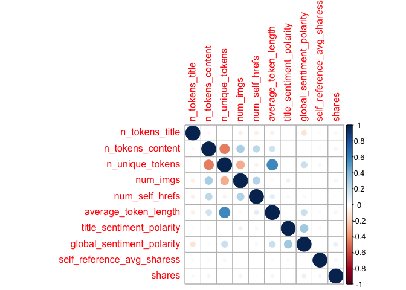
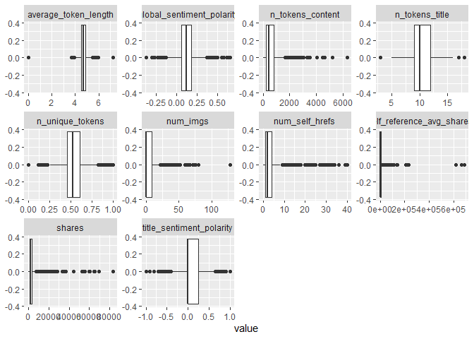
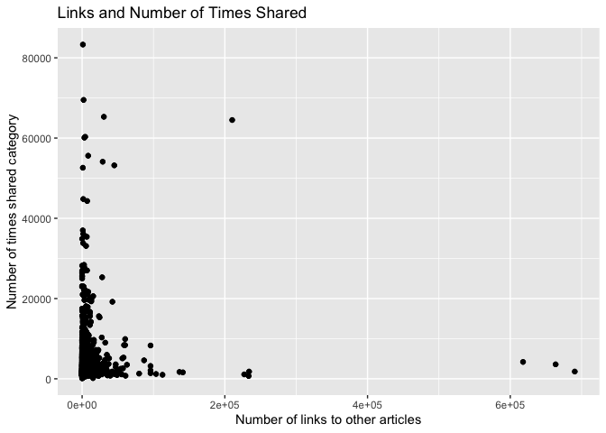

ProjectCode
================
Colleen Moore
10/8/2020

-   [Variable selection](#variable-selection)
-   [Create Training and Test Sets](#create-training-and-test-sets)
-   [Summarizations](#summarizations)
-   [Modeling](#modeling)
    -   [Tree based Model](#tree-based-model)
    -   [Boosted Tree Model](#boosted-tree-model)

*This analysis is for Sunday*

Read in data

    news<- read_csv("OnlineNewsPopularity.csv")

    ## Parsed with column specification:
    ## cols(
    ##   .default = col_double(),
    ##   url = col_character()
    ## )

    ## See spec(...) for full column specifications.

Filter for the day of the week

    dailyNews <- filter(news, news[[paste0("weekday_is_",params$day)]] == "1")

### Variable selection

    dailyNews<- dailyNews %>% 
      mutate(channel= case_when(data_channel_is_bus == 1 ~ "Business",
                                             data_channel_is_entertainment==1 ~"Entertainment",
                                                data_channel_is_lifestyle== 1 ~ "Lifesytle",
                                                data_channel_is_socmed==1 ~ "SocialMedia",
                                                data_channel_is_tech==1 ~ "Tech",
                                                data_channel_is_world== 1 ~ "World")) %>% select(n_tokens_title, n_tokens_content, n_unique_tokens, num_imgs, num_self_hrefs, average_token_length, title_sentiment_polarity, global_sentiment_polarity, shares, channel)

Check dataset for missing values

    dailyNews %>% summarise_all(funs(sum(is.na(.))))

    ## # A tibble: 1 x 10
    ##   n_tokens_title n_tokens_content n_unique_tokens num_imgs num_self_hrefs
    ##            <int>            <int>           <int>    <int>          <int>
    ## 1              0                0               0        0              0
    ## # … with 5 more variables: average_token_length <int>,
    ## #   title_sentiment_polarity <int>, global_sentiment_polarity <int>,
    ## #   shares <int>, channel <int>

Since I created a new variable channel, some news articles did not fall
into any of the listed categories and so are NA values. Replace the NA
values with “None”

    dailyNews$channel <- ifelse(is.na(dailyNews$channel), "None", dailyNews$channel)

Create Training and Test Sets
-----------------------------

Split data into training and test set- 70% of the data will be used for
training and 30% will be used for testing.

    set.seed(2011)
    train <- sample(1:nrow(dailyNews), size = nrow(dailyNews)*0.7)
    test <- setdiff(1:nrow(dailyNews), train)
    dailyNewsTrain <- dailyNews[train, ]
    dailyNewsTest <- dailyNews[test, ]

Summarizations
--------------

Quick summary of all the variables in the dataset. Wanted to get an idea
of the ranges of the variables.

    kable(apply(dailyNewsTrain[1:9], 2, summary), caption = paste("Summary of Variables"), digits= 1)

<table>
<caption>
Summary of Variables
</caption>
<thead>
<tr>
<th style="text-align:left;">
</th>
<th style="text-align:right;">
n\_tokens\_title
</th>
<th style="text-align:right;">
n\_tokens\_content
</th>
<th style="text-align:right;">
n\_unique\_tokens
</th>
<th style="text-align:right;">
num\_imgs
</th>
<th style="text-align:right;">
num\_self\_hrefs
</th>
<th style="text-align:right;">
average\_token\_length
</th>
<th style="text-align:right;">
title\_sentiment\_polarity
</th>
<th style="text-align:right;">
global\_sentiment\_polarity
</th>
<th style="text-align:right;">
shares
</th>
</tr>
</thead>
<tbody>
<tr>
<td style="text-align:left;">
Min.
</td>
<td style="text-align:right;">
3.0
</td>
<td style="text-align:right;">
0.0
</td>
<td style="text-align:right;">
0.0
</td>
<td style="text-align:right;">
0.0
</td>
<td style="text-align:right;">
0.0
</td>
<td style="text-align:right;">
0.0
</td>
<td style="text-align:right;">
-1.0
</td>
<td style="text-align:right;">
-0.4
</td>
<td style="text-align:right;">
91.0
</td>
</tr>
<tr>
<td style="text-align:left;">
1st Qu.
</td>
<td style="text-align:right;">
9.0
</td>
<td style="text-align:right;">
247.0
</td>
<td style="text-align:right;">
0.5
</td>
<td style="text-align:right;">
1.0
</td>
<td style="text-align:right;">
1.0
</td>
<td style="text-align:right;">
4.5
</td>
<td style="text-align:right;">
0.0
</td>
<td style="text-align:right;">
0.1
</td>
<td style="text-align:right;">
1200.0
</td>
</tr>
<tr>
<td style="text-align:left;">
Median
</td>
<td style="text-align:right;">
10.0
</td>
<td style="text-align:right;">
463.0
</td>
<td style="text-align:right;">
0.5
</td>
<td style="text-align:right;">
1.0
</td>
<td style="text-align:right;">
2.0
</td>
<td style="text-align:right;">
4.7
</td>
<td style="text-align:right;">
0.0
</td>
<td style="text-align:right;">
0.1
</td>
<td style="text-align:right;">
1800.0
</td>
</tr>
<tr>
<td style="text-align:left;">
Mean
</td>
<td style="text-align:right;">
10.4
</td>
<td style="text-align:right;">
605.7
</td>
<td style="text-align:right;">
0.5
</td>
<td style="text-align:right;">
5.8
</td>
<td style="text-align:right;">
3.6
</td>
<td style="text-align:right;">
4.6
</td>
<td style="text-align:right;">
0.1
</td>
<td style="text-align:right;">
0.1
</td>
<td style="text-align:right;">
3748.3
</td>
</tr>
<tr>
<td style="text-align:left;">
3rd Qu.
</td>
<td style="text-align:right;">
12.0
</td>
<td style="text-align:right;">
813.5
</td>
<td style="text-align:right;">
0.6
</td>
<td style="text-align:right;">
9.0
</td>
<td style="text-align:right;">
4.0
</td>
<td style="text-align:right;">
4.9
</td>
<td style="text-align:right;">
0.2
</td>
<td style="text-align:right;">
0.2
</td>
<td style="text-align:right;">
3600.0
</td>
</tr>
<tr>
<td style="text-align:left;">
Max.
</td>
<td style="text-align:right;">
18.0
</td>
<td style="text-align:right;">
6336.0
</td>
<td style="text-align:right;">
1.0
</td>
<td style="text-align:right;">
128.0
</td>
<td style="text-align:right;">
40.0
</td>
<td style="text-align:right;">
7.2
</td>
<td style="text-align:right;">
1.0
</td>
<td style="text-align:right;">
0.7
</td>
<td style="text-align:right;">
83300.0
</td>
</tr>
</tbody>
</table>

Correlation plot of variable choosen to be included in model. seeing if
any of the chosen variables are highly correlated with the response
variable shares or among each other.

    correlation <- dailyNewsTrain %>% keep(is.numeric) %>% cor()
    corrplot(correlation)

<!-- -->

Boxplots of all the variables to be used in the model to get an idea of
shape and if outliers are present.

    dailyNewsTrain %>%
    keep(is.numeric) %>%
    pivot_longer(everything()) %>%
    ggplot(aes(x = value)) +
    facet_wrap(~ name, scales = "free") +
    geom_boxplot()

<!-- -->

None of the variables appear to have a high correlation with the shares
variable. Below is a plot of number of links of other articles and
shares category.

    ggplot(dailyNewsTrain, aes(num_self_hrefs, shares))+ geom_point()+ geom_jitter() + labs(x= "Number of links to other articles", y= "Number of times shared category", title= "Links and Number of Times Shared")

<!-- -->

Modeling
--------

### Tree based Model

The first model is a classification tree-based model (not ensemble)
using leave one out cross validation. I will be using rpart from the
`caret` package for this tree.

    Tree_fit<- train(shares ~.,  data= dailyNewsTrain, method= "rpart",
                     trControl=trainControl(method = "LOOCV"),
                    preProcess = c("center", "scale"))

    Tree_fit

    ## CART 
    ## 
    ## 1915 samples
    ##    9 predictor
    ## 
    ## Pre-processing: centered (14), scaled (14) 
    ## Resampling: Leave-One-Out Cross-Validation 
    ## Summary of sample sizes: 1914, 1914, 1914, 1914, 1914, 1914, ... 
    ## Resampling results across tuning parameters:
    ## 
    ##   cp          RMSE      Rsquared      MAE     
    ##   0.01155279  6543.063  1.244531e-05  3251.745
    ##   0.01275324  6512.760  2.989317e-03  3360.744
    ##   0.01882334  6350.256  1.571113e-03  3172.656
    ## 
    ## RMSE was used to select the optimal model using the smallest value.
    ## The final value used for the model was cp = 0.01882334.

See how this model did on the training dataset

    pred_Tree_fit<- predict(Tree_fit, newdata= dailyNewsTest)
    modelA<- postResample(pred_Tree_fit, obs= dailyNewsTest$shares)
    modelA

    ##     RMSE Rsquared      MAE 
    ## 6067.773       NA 2967.603

### Boosted Tree Model

The next model is a classification boosted tree model with parameters
choosen using cross validation. I chose the Stochastic Gradient Boosting
method (gbm method).

    fit_control <- trainControl(method="cv", number=10)

    grid <- expand.grid(n.trees=c(25, 50, 100, 200,500), shrinkage=c(0.05, 0.1, 0.15),
                        n.minobsinnode = c(5,10, 15),interaction.depth=1)

    boostedTree <-train(shares ~ ., data= dailyNewsTrain, method='gbm', trControl=fit_control, tuneGrid=grid, verbose= FALSE)

    boostedTree

    ## Stochastic Gradient Boosting 
    ## 
    ## 1915 samples
    ##    9 predictor
    ## 
    ## No pre-processing
    ## Resampling: Cross-Validated (10 fold) 
    ## Summary of sample sizes: 1724, 1725, 1724, 1723, 1724, 1724, ... 
    ## Resampling results across tuning parameters:
    ## 
    ##   shrinkage  n.minobsinnode  n.trees  RMSE      Rsquared    MAE     
    ##   0.05        5               25      6140.818  0.02233961  3084.690
    ##   0.05        5               50      6134.086  0.02586129  3083.111
    ##   0.05        5              100      6131.254  0.02574262  3079.930
    ##   0.05        5              200      6143.920  0.02147605  3072.854
    ##   0.05        5              500      6196.361  0.01885566  3081.125
    ##   0.05       10               25      6129.623  0.02744640  3081.486
    ##   0.05       10               50      6127.995  0.02933112  3075.294
    ##   0.05       10              100      6117.987  0.02785060  3074.474
    ##   0.05       10              200      6125.502  0.02400712  3060.273
    ##   0.05       10              500      6142.943  0.02412578  3071.877
    ##   0.05       15               25      6140.573  0.01623820  3072.234
    ##   0.05       15               50      6133.480  0.01845879  3077.479
    ##   0.05       15              100      6125.674  0.02088378  3078.012
    ##   0.05       15              200      6123.999  0.02201178  3068.268
    ##   0.05       15              500      6140.709  0.02295886  3073.728
    ##   0.10        5               25      6142.794  0.01949439  3071.202
    ##   0.10        5               50      6139.097  0.01913644  3077.351
    ##   0.10        5              100      6146.340  0.02174440  3082.202
    ##   0.10        5              200      6189.059  0.01891571  3092.932
    ##   0.10        5              500      6267.454  0.01795754  3107.579
    ##   0.10       10               25      6119.926  0.02717572  3073.558
    ##   0.10       10               50      6112.349  0.02830420  3062.493
    ##   0.10       10              100      6136.890  0.02241033  3071.188
    ##   0.10       10              200      6151.624  0.02083886  3067.766
    ##   0.10       10              500      6179.049  0.02133666  3097.610
    ##   0.10       15               25      6136.053  0.01594868  3071.372
    ##   0.10       15               50      6143.281  0.01653070  3077.338
    ##   0.10       15              100      6128.363  0.02102135  3066.340
    ##   0.10       15              200      6142.903  0.02150783  3062.689
    ##   0.10       15              500      6180.918  0.02190989  3105.398
    ##   0.15        5               25      6117.858  0.02560683  3062.699
    ##   0.15        5               50      6150.878  0.02049580  3084.257
    ##   0.15        5              100      6171.223  0.02099553  3104.668
    ##   0.15        5              200      6251.563  0.01812799  3082.193
    ##   0.15        5              500      6363.293  0.01681972  3132.849
    ##   0.15       10               25      6137.258  0.02172265  3084.580
    ##   0.15       10               50      6128.588  0.02200584  3064.979
    ##   0.15       10              100      6131.994  0.02376919  3072.461
    ##   0.15       10              200      6140.497  0.02848363  3082.847
    ##   0.15       10              500      6202.870  0.02184539  3138.620
    ##   0.15       15               25      6130.654  0.01980487  3082.834
    ##   0.15       15               50      6135.458  0.02016951  3080.611
    ##   0.15       15              100      6137.048  0.02025570  3074.473
    ##   0.15       15              200      6155.370  0.02056341  3078.394
    ##   0.15       15              500      6199.168  0.02132750  3124.138
    ## 
    ## Tuning parameter 'interaction.depth' was held constant at a value of 1
    ## RMSE was used to select the optimal model using the smallest value.
    ## The final values used for the model were n.trees = 50, interaction.depth =
    ##  1, shrinkage = 0.1 and n.minobsinnode = 10.

Test the model on the test dataset.

    pred_boostedTree<- predict(boostedTree, newdata= dailyNewsTest)
    modelB<- postResample(pred_boostedTree, obs= dailyNewsTest$shares)
    modelB

    ##         RMSE     Rsquared          MAE 
    ## 6.146724e+03 6.887247e-05 3.005363e+03

Out of the two models, the one with the lowest RMSE of 6067.7732 was the
tree based model
