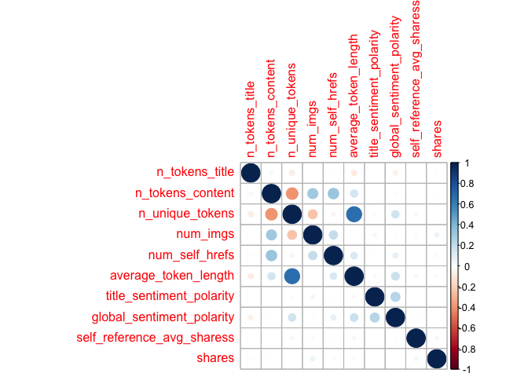
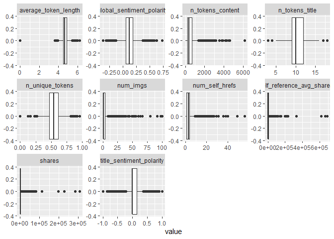
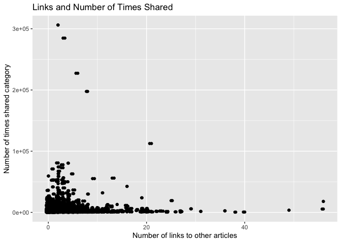

ProjectCode
================
Colleen Moore
10/8/2020

-   [\*\* Analysis for Thursday \*\*](#analysis-for-thursday)
    -   [Read in data](#read-in-data)
        -   [Filter for the day of the
            week](#filter-for-the-day-of-the-week)
    -   [Variable selection](#variable-selection)
        -   [Code for variable select and
            modification](#code-for-variable-select-and-modification)
        -   [Check dataset for missing
            values](#check-dataset-for-missing-values)
    -   [Create Training and Test Sets](#create-training-and-test-sets)
    -   [Summarizations](#summarizations)
        -   [Summary of all the included
            variables](#summary-of-all-the-included-variables)
        -   [Correlation plot](#correlation-plot)
        -   [Boxplots](#boxplots)
        -   [Scatterplot](#scatterplot)
    -   [Modeling](#modeling)
        -   [Tree based Model](#tree-based-model)
        -   [Boosted Tree Model](#boosted-tree-model)
    -   [Part 2 - Laura Mathews](#part-2---laura-mathews)
    -   [Best Model](#best-model)

\*\* Analysis for Thursday \*\*
===============================

Read in data
------------

    news<- read_csv("OnlineNewsPopularity.csv")

### Filter for the day of the week

    dailyNews <- filter(news, news[[paste0("weekday_is_",params$day)]] == "1")

Variable selection
------------------

The variables I chose were:

-   n\_tokens\_title: Number of words in the title  
-   n\_tokens\_content: Number of words in the content  
-   n\_unique\_tokens: Rate of unique words in the content  
-   num\_imgs: Number of images  
-   num\_self\_hrefs: Number of links to other articles published by
    Mashable  
-   average\_token\_length: Average length of the words in the content  
-   self\_reference\_avg\_sharess: Avg. shares of referenced articles in
    Mashable
-   global\_sentiment\_polarity: Text sentiment polarity
-   data\_channel - which is a derived variable from:
    -   data\_channel\_is\_lifestyle: Is data channel ‘Lifestyle’?
    -   data\_channel\_is\_entertainment: Is data channel
        ‘Entertainment’?
    -   data\_channel\_is\_bus: Is data channel ‘Business’?
    -   data\_channel\_is\_socmed: Is data channel ‘Social Media’?
    -   data\_channel\_is\_tech: Is data channel ‘Tech’?
    -   data\_channel\_is\_world: Is data channel ‘World’?
-   title\_sentiment\_polarity: Title polarity

### Code for variable select and modification

    dailyNews<- dailyNews %>% 
      mutate(channel= case_when(data_channel_is_bus == 1 ~ "Business",
                                             data_channel_is_entertainment==1 ~"Entertainment",
                                                data_channel_is_lifestyle== 1 ~ "Lifesytle",
                                                data_channel_is_socmed==1 ~ "SocialMedia",
                                                data_channel_is_tech==1 ~ "Tech",
                                                data_channel_is_world== 1 ~ "World")) %>% 
      select(n_tokens_title, n_tokens_content, n_unique_tokens, num_imgs, num_self_hrefs, 
             average_token_length, title_sentiment_polarity, global_sentiment_polarity,
             self_reference_avg_sharess, shares, channel)

### Check dataset for missing values

    miss<- dailyNews %>% summarise_all(funs(sum(is.na(.))))
    kable(miss)

<table>
<thead>
<tr>
<th style="text-align:right;">
n\_tokens\_title
</th>
<th style="text-align:right;">
n\_tokens\_content
</th>
<th style="text-align:right;">
n\_unique\_tokens
</th>
<th style="text-align:right;">
num\_imgs
</th>
<th style="text-align:right;">
num\_self\_hrefs
</th>
<th style="text-align:right;">
average\_token\_length
</th>
<th style="text-align:right;">
title\_sentiment\_polarity
</th>
<th style="text-align:right;">
global\_sentiment\_polarity
</th>
<th style="text-align:right;">
self\_reference\_avg\_sharess
</th>
<th style="text-align:right;">
shares
</th>
<th style="text-align:right;">
channel
</th>
</tr>
</thead>
<tbody>
<tr>
<td style="text-align:right;">
0
</td>
<td style="text-align:right;">
0
</td>
<td style="text-align:right;">
0
</td>
<td style="text-align:right;">
0
</td>
<td style="text-align:right;">
0
</td>
<td style="text-align:right;">
0
</td>
<td style="text-align:right;">
0
</td>
<td style="text-align:right;">
0
</td>
<td style="text-align:right;">
0
</td>
<td style="text-align:right;">
0
</td>
<td style="text-align:right;">
1102
</td>
</tr>
</tbody>
</table>

Since I created a new variable channel, some news articles did not fall
into any of the listed categories and so are NA values. Replace the NA
values with “None”

    dailyNews$channel <- ifelse(is.na(dailyNews$channel), "None", dailyNews$channel)

Create Training and Test Sets
-----------------------------

Split data into training and test set- 70% of the data will be used for
training and 30% will be used for testing.

    set.seed(2011)
    train <- sample(1:nrow(dailyNews), size = nrow(dailyNews)*0.7)
    test <- setdiff(1:nrow(dailyNews), train)
    dailyNewsTrain <- dailyNews[train, ]
    dailyNewsTest <- dailyNews[test, ]

Summarizations
--------------

### Summary of all the included variables

Quick summary of all the variables in the dataset. Wanted to get an idea
of the ranges of the variables.

    kable(apply(dailyNewsTrain[1:10], 2, summary), caption = paste("Summary of Variables"), digits= 1)

<table>
<caption>
Summary of Variables
</caption>
<thead>
<tr>
<th style="text-align:left;">
</th>
<th style="text-align:right;">
n\_tokens\_title
</th>
<th style="text-align:right;">
n\_tokens\_content
</th>
<th style="text-align:right;">
n\_unique\_tokens
</th>
<th style="text-align:right;">
num\_imgs
</th>
<th style="text-align:right;">
num\_self\_hrefs
</th>
<th style="text-align:right;">
average\_token\_length
</th>
<th style="text-align:right;">
title\_sentiment\_polarity
</th>
<th style="text-align:right;">
global\_sentiment\_polarity
</th>
<th style="text-align:right;">
self\_reference\_avg\_sharess
</th>
<th style="text-align:right;">
shares
</th>
</tr>
</thead>
<tbody>
<tr>
<td style="text-align:left;">
Min.
</td>
<td style="text-align:right;">
3.0
</td>
<td style="text-align:right;">
0.0
</td>
<td style="text-align:right;">
0.0
</td>
<td style="text-align:right;">
0.0
</td>
<td style="text-align:right;">
0.0
</td>
<td style="text-align:right;">
0.0
</td>
<td style="text-align:right;">
-1.0
</td>
<td style="text-align:right;">
-0.4
</td>
<td style="text-align:right;">
0.0
</td>
<td style="text-align:right;">
5.0
</td>
</tr>
<tr>
<td style="text-align:left;">
1st Qu.
</td>
<td style="text-align:right;">
9.0
</td>
<td style="text-align:right;">
244.0
</td>
<td style="text-align:right;">
0.5
</td>
<td style="text-align:right;">
1.0
</td>
<td style="text-align:right;">
1.0
</td>
<td style="text-align:right;">
4.5
</td>
<td style="text-align:right;">
0.0
</td>
<td style="text-align:right;">
0.1
</td>
<td style="text-align:right;">
935.2
</td>
<td style="text-align:right;">
906.0
</td>
</tr>
<tr>
<td style="text-align:left;">
Median
</td>
<td style="text-align:right;">
10.0
</td>
<td style="text-align:right;">
395.0
</td>
<td style="text-align:right;">
0.5
</td>
<td style="text-align:right;">
1.0
</td>
<td style="text-align:right;">
3.0
</td>
<td style="text-align:right;">
4.7
</td>
<td style="text-align:right;">
0.0
</td>
<td style="text-align:right;">
0.1
</td>
<td style="text-align:right;">
2200.0
</td>
<td style="text-align:right;">
1400.0
</td>
</tr>
<tr>
<td style="text-align:left;">
Mean
</td>
<td style="text-align:right;">
10.3
</td>
<td style="text-align:right;">
538.4
</td>
<td style="text-align:right;">
0.5
</td>
<td style="text-align:right;">
4.4
</td>
<td style="text-align:right;">
3.2
</td>
<td style="text-align:right;">
4.6
</td>
<td style="text-align:right;">
0.1
</td>
<td style="text-align:right;">
0.1
</td>
<td style="text-align:right;">
6246.9
</td>
<td style="text-align:right;">
3138.9
</td>
</tr>
<tr>
<td style="text-align:left;">
3rd Qu.
</td>
<td style="text-align:right;">
12.0
</td>
<td style="text-align:right;">
686.8
</td>
<td style="text-align:right;">
0.6
</td>
<td style="text-align:right;">
4.0
</td>
<td style="text-align:right;">
4.0
</td>
<td style="text-align:right;">
4.9
</td>
<td style="text-align:right;">
0.1
</td>
<td style="text-align:right;">
0.2
</td>
<td style="text-align:right;">
5064.9
</td>
<td style="text-align:right;">
2600.0
</td>
</tr>
<tr>
<td style="text-align:left;">
Max.
</td>
<td style="text-align:right;">
18.0
</td>
<td style="text-align:right;">
6159.0
</td>
<td style="text-align:right;">
1.0
</td>
<td style="text-align:right;">
100.0
</td>
<td style="text-align:right;">
56.0
</td>
<td style="text-align:right;">
6.2
</td>
<td style="text-align:right;">
1.0
</td>
<td style="text-align:right;">
0.7
</td>
<td style="text-align:right;">
690400.0
</td>
<td style="text-align:right;">
306100.0
</td>
</tr>
</tbody>
</table>

### Correlation plot

Correlation plot of variable choosen to be included in model. Seeing if
any of the chosen variables are highly correlated with the response
variable shares or among each other.

    correlation <- dailyNewsTrain %>% keep(is.numeric) %>% cor()
    corrplot(correlation)

<!-- -->

None of the variables appear to have a high correlation with the shares
variable.

### Boxplots

Boxplots of all the variables to be used in the model to get an idea of
shape and if outliers are present.

    dailyNewsTrain %>%
    keep(is.numeric) %>%
    pivot_longer(everything()) %>%
    ggplot(aes(x = value)) +
    facet_wrap(~ name, scales = "free") +
    geom_boxplot()

<!-- -->

### Scatterplot

Below is a plot of self\_reference\_avg\_sharess (Avg. shares of
referenced articles in Mashable) and shares category.

    ggplot(dailyNewsTrain, aes(self_reference_avg_sharess,shares))+ 
      geom_point()+ geom_jitter() + 
      labs(x= "Number of links to other articles", y= "Number of times shared category", 
           title= "Links and Number of Times Shared")

<!-- -->

Modeling
--------

### Tree based Model

The first model is a classification tree-based model (not ensemble)
using leave one out cross validation. I will be using rpart from the
`caret` package for this tree.

    Tree_fit<- train(shares ~.,  data= dailyNewsTrain, method= "rpart",
                     trControl=trainControl(method = "LOOCV"),
                    preProcess = c("center", "scale"))

    Tree_fit

    ## CART 
    ## 
    ## 5086 samples
    ##   10 predictor
    ## 
    ## Pre-processing: centered (15), scaled (15) 
    ## Resampling: Leave-One-Out Cross-Validation 
    ## Summary of sample sizes: 5085, 5085, 5085, 5085, 5085, 5085, ... 
    ## Resampling results across tuning parameters:
    ## 
    ##   cp           RMSE      Rsquared      MAE     
    ##   0.007096685  9576.199  1.429037e-03  2970.916
    ##   0.009416543  9624.422  5.060364e-07  3242.720
    ##   0.019185909  9374.456  5.480451e-03  3203.770
    ## 
    ## RMSE was used to select the optimal model using the smallest value.
    ## The final value used for the model was cp = 0.01918591.

Test the tree based model on the test data set.

    pred_Tree_fit<- predict(Tree_fit, newdata= dailyNewsTest)
    modelA<- postResample(pred_Tree_fit, obs= dailyNewsTest$shares)
    modelA

    ##     RMSE Rsquared      MAE 
    ## 9894.860       NA 3099.326

### Boosted Tree Model

The next model is a classification boosted tree model with parameters
choosen using cross validation. I chose the Stochastic Gradient Boosting
method (gbm method).

    fit_control <- trainControl(method="cv", number=10)

    grid <- expand.grid(n.trees=c(25, 50, 100, 200,500), shrinkage=c(0.05, 0.1, 0.15),
                        n.minobsinnode = c(5,10, 15),interaction.depth=1)

    boostedTree <-train(shares ~ ., data= dailyNewsTrain, method='gbm',
                        trControl=fit_control, tuneGrid=grid, verbose= FALSE)

    boostedTree

    ## Stochastic Gradient Boosting 
    ## 
    ## 5086 samples
    ##   10 predictor
    ## 
    ## No pre-processing
    ## Resampling: Cross-Validated (10 fold) 
    ## Summary of sample sizes: 4578, 4577, 4577, 4577, 4577, 4577, ... 
    ## Resampling results across tuning parameters:
    ## 
    ##   shrinkage  n.minobsinnode  n.trees  RMSE      Rsquared    MAE     
    ##   0.05        5               25      8177.468  0.03798625  2816.728
    ##   0.05        5               50      8166.053  0.03441689  2805.225
    ##   0.05        5              100      8179.010  0.03216087  2806.313
    ##   0.05        5              200      8191.365  0.03074230  2802.791
    ##   0.05        5              500      8212.928  0.02813575  2831.394
    ##   0.05       10               25      8181.852  0.03341395  2822.678
    ##   0.05       10               50      8171.143  0.03194918  2802.013
    ##   0.05       10              100      8175.041  0.03173421  2799.791
    ##   0.05       10              200      8188.302  0.03137173  2815.928
    ##   0.05       10              500      8208.716  0.02884928  2831.756
    ##   0.05       15               25      8183.067  0.03372119  2818.633
    ##   0.05       15               50      8167.517  0.03383382  2802.224
    ##   0.05       15              100      8171.819  0.03279361  2793.968
    ##   0.05       15              200      8180.661  0.03269311  2805.125
    ##   0.05       15              500      8203.533  0.02975329  2832.639
    ##   0.10        5               25      8172.742  0.03184210  2816.415
    ##   0.10        5               50      8183.833  0.03085104  2808.059
    ##   0.10        5              100      8203.241  0.02866656  2811.990
    ##   0.10        5              200      8209.223  0.02847487  2826.106
    ##   0.10        5              500      8245.655  0.02440141  2859.450
    ##   0.10       10               25      8172.500  0.03136421  2802.549
    ##   0.10       10               50      8186.529  0.02917436  2809.151
    ##   0.10       10              100      8196.326  0.02974245  2814.203
    ##   0.10       10              200      8211.353  0.02876347  2843.706
    ##   0.10       10              500      8226.688  0.02691026  2844.333
    ##   0.10       15               25      8167.568  0.03391871  2797.950
    ##   0.10       15               50      8179.934  0.03104618  2801.935
    ##   0.10       15              100      8187.919  0.03149633  2811.192
    ##   0.10       15              200      8206.718  0.02889055  2825.565
    ##   0.10       15              500      8237.518  0.02477669  2863.887
    ##   0.15        5               25      8180.741  0.03122126  2810.178
    ##   0.15        5               50      8194.250  0.03011309  2818.360
    ##   0.15        5              100      8196.214  0.03072978  2825.114
    ##   0.15        5              200      8216.356  0.02837902  2845.682
    ##   0.15        5              500      8256.412  0.02446888  2888.615
    ##   0.15       10               25      8170.529  0.03268215  2794.221
    ##   0.15       10               50      8182.077  0.03126121  2818.072
    ##   0.15       10              100      8205.058  0.02857250  2822.110
    ##   0.15       10              200      8218.050  0.02781076  2853.829
    ##   0.15       10              500      8245.602  0.02529774  2865.410
    ##   0.15       15               25      8175.595  0.03111825  2803.611
    ##   0.15       15               50      8193.421  0.03072346  2824.772
    ##   0.15       15              100      8200.232  0.02946191  2826.611
    ##   0.15       15              200      8213.383  0.02743239  2831.841
    ##   0.15       15              500      8249.560  0.02530155  2889.353
    ## 
    ## Tuning parameter 'interaction.depth' was held constant at a value of 1
    ## RMSE was used to select the optimal model using the smallest value.
    ## The final values used for the model were n.trees = 50, interaction.depth =
    ##  1, shrinkage = 0.05 and n.minobsinnode = 5.

Test the model on the test dataset.

    pred_boostedTree<- predict(boostedTree, newdata= dailyNewsTest)
    modelB<- postResample(pred_boostedTree, obs= dailyNewsTest$shares)
    modelB

    ##         RMSE     Rsquared          MAE 
    ## 9.788389e+03 2.372067e-02 3.015176e+03

Part 2 - Laura Mathews
----------------------

For the second portion of this project, the data was used to fit a
linear model.

    #Train the model on the train data set
    lm <- train(shares ~ ., data = dailyNewsTrain, method = "lm",
                preProcess = c("center", "scale"),
                trControl = trainControl(method = "cv", number = 10))

    #Predict on the test set
    predLm <- predict(lm, newdata = dailyNewsTest)

    modelL <- postResample(predLm, dailyNewsTest$shares)
    modelL

    ##         RMSE     Rsquared          MAE 
    ## 9.844771e+03 1.048476e-02 3.047094e+03

Best Model
----------

Out of the three models, the one with the lowest RMSE of 9788.3887017
was the boosted tree model
