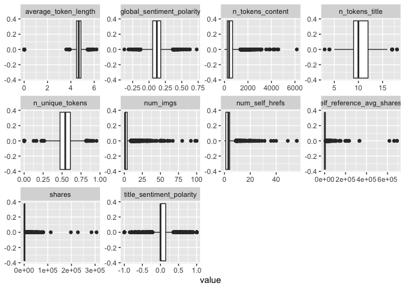
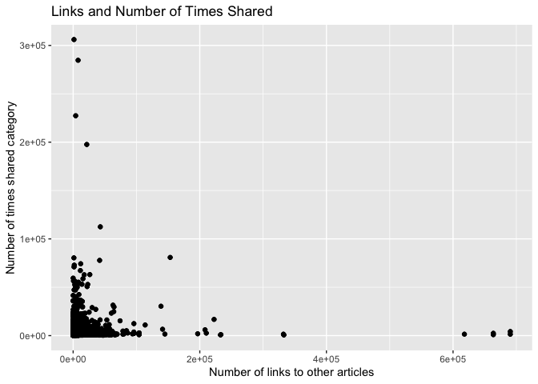

ProjectCode
================
Colleen Moore
10/8/2020

-   [Variable selection](#variable-selection)
-   [Create Training and Test Sets](#create-training-and-test-sets)
-   [Summarizations](#summarizations)
-   [Modeling](#modeling)
    -   [Tree based Model](#tree-based-model)
    -   [Boosted Tree Model](#boosted-tree-model)

*This analysis is for Thursday*

Read in data

    news<- read_csv("OnlineNewsPopularity.csv")

    ## Parsed with column specification:
    ## cols(
    ##   .default = col_double(),
    ##   url = col_character()
    ## )

    ## See spec(...) for full column specifications.

Filter for the day of the week

    dailyNews <- filter(news, news[[paste0("weekday_is_",params$day)]] == "1")

### Variable selection

    dailyNews<- dailyNews %>% 
      mutate(channel= case_when(data_channel_is_bus == 1 ~ "Business",
                                             data_channel_is_entertainment==1 ~"Entertainment",
                                                data_channel_is_lifestyle== 1 ~ "Lifesytle",
                                                data_channel_is_socmed==1 ~ "SocialMedia",
                                                data_channel_is_tech==1 ~ "Tech",
                                                data_channel_is_world== 1 ~ "World")) %>% select(n_tokens_title, n_tokens_content, n_unique_tokens, num_imgs, num_self_hrefs, average_token_length, title_sentiment_polarity, global_sentiment_polarity, shares, channel)

Check dataset for missing values

    dailyNews %>% summarise_all(funs(sum(is.na(.))))

    ## # A tibble: 1 x 10
    ##   n_tokens_title n_tokens_content n_unique_tokens num_imgs num_self_hrefs
    ##            <int>            <int>           <int>    <int>          <int>
    ## 1              0                0               0        0              0
    ## # … with 5 more variables: average_token_length <int>,
    ## #   title_sentiment_polarity <int>, global_sentiment_polarity <int>,
    ## #   shares <int>, channel <int>

Since I created a new variable channel, some news articles did not fall
into any of the listed categories and so are NA values. Replace the NA
values with “None”

    dailyNews$channel <- ifelse(is.na(dailyNews$channel), "None", dailyNews$channel)

Create Training and Test Sets
-----------------------------

Split data into training and test set- 70% of the data will be used for
training and 30% will be used for testing.

    set.seed(2011)
    train <- sample(1:nrow(dailyNews), size = nrow(dailyNews)*0.7)
    test <- setdiff(1:nrow(dailyNews), train)
    dailyNewsTrain <- dailyNews[train, ]
    dailyNewsTest <- dailyNews[test, ]

Summarizations
--------------

Quick summary of all the variables in the dataset. Wanted to get an idea
of the ranges of the variables.

    kable(apply(dailyNewsTrain[1:9], 2, summary), caption = paste("Summary of Variables"), digits= 1)

<table>
<caption>
Summary of Variables
</caption>
<thead>
<tr>
<th style="text-align:left;">
</th>
<th style="text-align:right;">
n\_tokens\_title
</th>
<th style="text-align:right;">
n\_tokens\_content
</th>
<th style="text-align:right;">
n\_unique\_tokens
</th>
<th style="text-align:right;">
num\_imgs
</th>
<th style="text-align:right;">
num\_self\_hrefs
</th>
<th style="text-align:right;">
average\_token\_length
</th>
<th style="text-align:right;">
title\_sentiment\_polarity
</th>
<th style="text-align:right;">
global\_sentiment\_polarity
</th>
<th style="text-align:right;">
shares
</th>
</tr>
</thead>
<tbody>
<tr>
<td style="text-align:left;">
Min.
</td>
<td style="text-align:right;">
3.0
</td>
<td style="text-align:right;">
0.0
</td>
<td style="text-align:right;">
0.0
</td>
<td style="text-align:right;">
0.0
</td>
<td style="text-align:right;">
0.0
</td>
<td style="text-align:right;">
0.0
</td>
<td style="text-align:right;">
-1.0
</td>
<td style="text-align:right;">
-0.4
</td>
<td style="text-align:right;">
5.0
</td>
</tr>
<tr>
<td style="text-align:left;">
1st Qu.
</td>
<td style="text-align:right;">
9.0
</td>
<td style="text-align:right;">
244.0
</td>
<td style="text-align:right;">
0.5
</td>
<td style="text-align:right;">
1.0
</td>
<td style="text-align:right;">
1.0
</td>
<td style="text-align:right;">
4.5
</td>
<td style="text-align:right;">
0.0
</td>
<td style="text-align:right;">
0.1
</td>
<td style="text-align:right;">
906.0
</td>
</tr>
<tr>
<td style="text-align:left;">
Median
</td>
<td style="text-align:right;">
10.0
</td>
<td style="text-align:right;">
395.0
</td>
<td style="text-align:right;">
0.5
</td>
<td style="text-align:right;">
1.0
</td>
<td style="text-align:right;">
3.0
</td>
<td style="text-align:right;">
4.7
</td>
<td style="text-align:right;">
0.0
</td>
<td style="text-align:right;">
0.1
</td>
<td style="text-align:right;">
1400.0
</td>
</tr>
<tr>
<td style="text-align:left;">
Mean
</td>
<td style="text-align:right;">
10.3
</td>
<td style="text-align:right;">
538.4
</td>
<td style="text-align:right;">
0.5
</td>
<td style="text-align:right;">
4.4
</td>
<td style="text-align:right;">
3.2
</td>
<td style="text-align:right;">
4.6
</td>
<td style="text-align:right;">
0.1
</td>
<td style="text-align:right;">
0.1
</td>
<td style="text-align:right;">
3138.9
</td>
</tr>
<tr>
<td style="text-align:left;">
3rd Qu.
</td>
<td style="text-align:right;">
12.0
</td>
<td style="text-align:right;">
686.8
</td>
<td style="text-align:right;">
0.6
</td>
<td style="text-align:right;">
4.0
</td>
<td style="text-align:right;">
4.0
</td>
<td style="text-align:right;">
4.9
</td>
<td style="text-align:right;">
0.1
</td>
<td style="text-align:right;">
0.2
</td>
<td style="text-align:right;">
2600.0
</td>
</tr>
<tr>
<td style="text-align:left;">
Max.
</td>
<td style="text-align:right;">
18.0
</td>
<td style="text-align:right;">
6159.0
</td>
<td style="text-align:right;">
1.0
</td>
<td style="text-align:right;">
100.0
</td>
<td style="text-align:right;">
56.0
</td>
<td style="text-align:right;">
6.2
</td>
<td style="text-align:right;">
1.0
</td>
<td style="text-align:right;">
0.7
</td>
<td style="text-align:right;">
306100.0
</td>
</tr>
</tbody>
</table>

Correlation plot of variable choosen to be included in model. seeing if
any of the chosen variables are highly correlated with the response
variable shares or among each other.

    correlation <- dailyNewsTrain %>% keep(is.numeric) %>% cor()
    corrplot(correlation)

<!-- -->

Boxplots of all the variables to be used in the model to get an idea of
shape and if outliers are present.

    dailyNewsTrain %>%
    keep(is.numeric) %>%
    pivot_longer(everything()) %>%
    ggplot(aes(x = value)) +
    facet_wrap(~ name, scales = "free") +
    geom_boxplot()

<!-- -->

None of the variables appear to have a high correlation with the shares
variable. Below is a plot of number of links of other articles and
shares category.

    ggplot(dailyNewsTrain, aes(num_self_hrefs, shares))+ geom_point()+ geom_jitter() + labs(x= "Number of links to other articles", y= "Number of times shared category", title= "Links and Number of Times Shared")

<!-- -->

Modeling
--------

### Tree based Model

The first model is a classification tree-based model (not ensemble)
using leave one out cross validation. I will be using rpart from the
`caret` package for this tree.

    Tree_fit<- train(shares ~.,  data= dailyNewsTrain, method= "rpart",
                     trControl=trainControl(method = "LOOCV"),
                    preProcess = c("center", "scale"))

    Tree_fit

    ## CART 
    ## 
    ## 5086 samples
    ##    9 predictor
    ## 
    ## Pre-processing: centered (14), scaled (14) 
    ## Resampling: Leave-One-Out Cross-Validation 
    ## Summary of sample sizes: 5085, 5085, 5085, 5085, 5085, 5085, ... 
    ## Resampling results across tuning parameters:
    ## 
    ##   cp           RMSE      Rsquared      MAE     
    ##   0.005021570  9696.543  0.0023178698  2987.510
    ##   0.009985695  9622.600  0.0007303738  3127.666
    ##   0.011597368  9352.680  0.0128997387  3209.695
    ## 
    ## RMSE was used to select the optimal model using the smallest value.
    ## The final value used for the model was cp = 0.01159737.

See how this model did on the training dataset

    pred_Tree_fit<- predict(Tree_fit, newdata= dailyNewsTest)
    modelA<- postResample(pred_Tree_fit, obs= dailyNewsTest$shares)
    modelA

    ##     RMSE Rsquared      MAE 
    ## 9894.860       NA 3099.326

### Boosted Tree Model

The next model is a classification boosted tree model with parameters
choosen using cross validation. I chose the Stochastic Gradient Boosting
method (gbm method).

    fit_control <- trainControl(method="cv", number=10)

    grid <- expand.grid(n.trees=c(25, 50, 100, 200,500), shrinkage=c(0.05, 0.1, 0.15),
                        n.minobsinnode = c(5,10, 15),interaction.depth=1)

    boostedTree <-train(shares ~ ., data= dailyNewsTrain, method='gbm', trControl=fit_control, tuneGrid=grid, verbose= FALSE)

    boostedTree

    ## Stochastic Gradient Boosting 
    ## 
    ## 5086 samples
    ##    9 predictor
    ## 
    ## No pre-processing
    ## Resampling: Cross-Validated (10 fold) 
    ## Summary of sample sizes: 4578, 4577, 4577, 4577, 4577, 4577, ... 
    ## Resampling results across tuning parameters:
    ## 
    ##   shrinkage  n.minobsinnode  n.trees  RMSE      Rsquared    MAE     
    ##   0.05        5               25      8204.891  0.02233233  2837.145
    ##   0.05        5               50      8204.477  0.02008602  2834.336
    ##   0.05        5              100      8216.081  0.01914524  2837.002
    ##   0.05        5              200      8222.177  0.01881215  2828.562
    ##   0.05        5              500      8241.767  0.01720306  2854.516
    ##   0.05       10               25      8207.172  0.02116448  2840.815
    ##   0.05       10               50      8203.301  0.02042515  2827.718
    ##   0.05       10              100      8210.792  0.01946635  2830.868
    ##   0.05       10              200      8221.714  0.01878112  2842.576
    ##   0.05       10              500      8238.902  0.01725710  2850.321
    ##   0.05       15               25      8206.835  0.02161039  2838.627
    ##   0.05       15               50      8203.656  0.02023074  2831.354
    ##   0.05       15              100      8208.722  0.01958109  2821.959
    ##   0.05       15              200      8217.217  0.01967329  2833.320
    ##   0.05       15              500      8235.692  0.01796870  2854.358
    ##   0.10        5               25      8208.012  0.01922446  2842.485
    ##   0.10        5               50      8219.015  0.01855945  2837.059
    ##   0.10        5              100      8231.529  0.01779525  2842.611
    ##   0.10        5              200      8240.776  0.01730464  2854.262
    ##   0.10        5              500      8271.061  0.01494859  2881.029
    ##   0.10       10               25      8211.857  0.01757340  2834.893
    ##   0.10       10               50      8223.670  0.01640382  2840.037
    ##   0.10       10              100      8229.512  0.01753475  2838.733
    ##   0.10       10              200      8239.075  0.01736672  2862.893
    ##   0.10       10              500      8257.574  0.01597016  2865.393
    ##   0.10       15               25      8200.431  0.02193608  2818.804
    ##   0.10       15               50      8214.115  0.01903628  2827.488
    ##   0.10       15              100      8225.665  0.01812096  2840.562
    ##   0.10       15              200      8231.090  0.01816823  2846.446
    ##   0.10       15              500      8260.375  0.01562248  2885.981
    ##   0.15        5               25      8216.600  0.01849151  2840.198
    ##   0.15        5               50      8229.951  0.01748953  2847.586
    ##   0.15        5              100      8241.498  0.01687967  2858.861
    ##   0.15        5              200      8253.475  0.01657596  2869.275
    ##   0.15        5              500      8291.936  0.01398904  2913.769
    ##   0.15       10               25      8211.540  0.01856793  2828.020
    ##   0.15       10               50      8225.756  0.01756614  2848.485
    ##   0.15       10              100      8227.868  0.01839802  2844.649
    ##   0.15       10              200      8242.403  0.01783080  2868.137
    ##   0.15       10              500      8278.149  0.01496323  2887.866
    ##   0.15       15               25      8207.359  0.02032722  2830.742
    ##   0.15       15               50      8225.066  0.01804174  2856.123
    ##   0.15       15              100      8229.191  0.01828444  2853.625
    ##   0.15       15              200      8250.703  0.01631064  2867.084
    ##   0.15       15              500      8273.422  0.01487320  2911.799
    ## 
    ## Tuning parameter 'interaction.depth' was held constant at a value of 1
    ## RMSE was used to select the optimal model using the smallest value.
    ## The final values used for the model were n.trees = 25, interaction.depth =
    ##  1, shrinkage = 0.1 and n.minobsinnode = 15.

Test the model on the test dataset.

    pred_boostedTree<- predict(boostedTree, newdata= dailyNewsTest)
    modelB<- postResample(pred_boostedTree, obs= dailyNewsTest$shares)
    modelB

    ##         RMSE     Rsquared          MAE 
    ## 9.849474e+03 9.535760e-03 3.049992e+03

Out of the two models, the one with the lowest RMSE of 9849.4737 was the
boosted tree model
