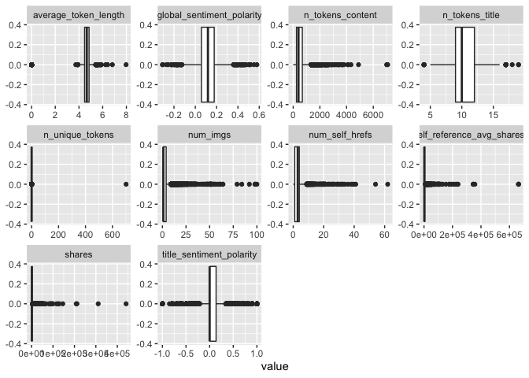

ProjectCode
================
Colleen Moore
10/8/2020

  - [\*\* Analysis for Tuesday \*\*](#analysis-for-tuesday)
      - [Read in data](#read-in-data)
          - [Filter for the day of the
            week](#filter-for-the-day-of-the-week)
      - [Variable selection](#variable-selection)
          - [Code for variable select and
            modification](#code-for-variable-select-and-modification)
          - [Check dataset for missing
            values](#check-dataset-for-missing-values)
      - [Create Training and Test Sets](#create-training-and-test-sets)
      - [Summarizations](#summarizations)
          - [Summary of all the included
            variables](#summary-of-all-the-included-variables)
          - [Correlation plot](#correlation-plot)
          - [Boxplots](#boxplots)
          - [Scatterplot](#scatterplot)
      - [Modeling](#modeling)
          - [Tree based Model](#tree-based-model)
          - [Boosted Tree Model](#boosted-tree-model)
      - [Part 2 - Laura Mathews](#part-2---laura-mathews)
      - [Best Model](#best-model)

# \*\* Analysis for Tuesday \*\*

## Read in data

``` r
news<- read_csv("OnlineNewsPopularity.csv")
```

### Filter for the day of the week

``` r
dailyNews <- filter(news, news[[paste0("weekday_is_",params$day)]] == "1")
```

## Variable selection

The variables I chose were:

  - n\_tokens\_title: Number of words in the title  
  - n\_tokens\_content: Number of words in the content  
  - n\_unique\_tokens: Rate of unique words in the content  
  - num\_imgs: Number of images  
  - num\_self\_hrefs: Number of links to other articles published by
    Mashable  
  - average\_token\_length: Average length of the words in the content  
  - self\_reference\_avg\_sharess: Avg. shares of referenced articles in
    Mashable
  - global\_sentiment\_polarity: Text sentiment polarity
  - data\_channel - which is a derived variable from:
      - data\_channel\_is\_lifestyle: Is data channel ‘Lifestyle’?
      - data\_channel\_is\_entertainment: Is data channel
        ‘Entertainment’?
      - data\_channel\_is\_bus: Is data channel ‘Business’?
      - data\_channel\_is\_socmed: Is data channel ‘Social Media’?
      - data\_channel\_is\_tech: Is data channel ‘Tech’?
      - data\_channel\_is\_world: Is data channel ‘World’?
  - title\_sentiment\_polarity: Title polarity

### Code for variable select and modification

``` r
dailyNews<- dailyNews %>% 
  mutate(channel= case_when(data_channel_is_bus == 1 ~ "Business",
                                         data_channel_is_entertainment==1 ~"Entertainment",
                                            data_channel_is_lifestyle== 1 ~ "Lifesytle",
                                            data_channel_is_socmed==1 ~ "SocialMedia",
                                            data_channel_is_tech==1 ~ "Tech",
                                            data_channel_is_world== 1 ~ "World")) %>% 
  select(n_tokens_title, n_tokens_content, n_unique_tokens, num_imgs, num_self_hrefs, 
         average_token_length, title_sentiment_polarity, global_sentiment_polarity,
         self_reference_avg_sharess, shares, channel)
```

### Check dataset for missing values

``` r
miss<- dailyNews %>% summarise_all(funs(sum(is.na(.))))
kable(miss)
```

<table>

<thead>

<tr>

<th style="text-align:right;">

n\_tokens\_title

</th>

<th style="text-align:right;">

n\_tokens\_content

</th>

<th style="text-align:right;">

n\_unique\_tokens

</th>

<th style="text-align:right;">

num\_imgs

</th>

<th style="text-align:right;">

num\_self\_hrefs

</th>

<th style="text-align:right;">

average\_token\_length

</th>

<th style="text-align:right;">

title\_sentiment\_polarity

</th>

<th style="text-align:right;">

global\_sentiment\_polarity

</th>

<th style="text-align:right;">

self\_reference\_avg\_sharess

</th>

<th style="text-align:right;">

shares

</th>

<th style="text-align:right;">

channel

</th>

</tr>

</thead>

<tbody>

<tr>

<td style="text-align:right;">

0

</td>

<td style="text-align:right;">

0

</td>

<td style="text-align:right;">

0

</td>

<td style="text-align:right;">

0

</td>

<td style="text-align:right;">

0

</td>

<td style="text-align:right;">

0

</td>

<td style="text-align:right;">

0

</td>

<td style="text-align:right;">

0

</td>

<td style="text-align:right;">

0

</td>

<td style="text-align:right;">

0

</td>

<td style="text-align:right;">

1111

</td>

</tr>

</tbody>

</table>

Since I created a new variable channel, some news articles did not fall
into any of the listed categories and so are NA values. Replace the NA
values with “None”

``` r
dailyNews$channel <- ifelse(is.na(dailyNews$channel), "None", dailyNews$channel)
```

## Create Training and Test Sets

Split data into training and test set- 70% of the data will be used for
training and 30% will be used for testing.

``` r
set.seed(2011)
train <- sample(1:nrow(dailyNews), size = nrow(dailyNews)*0.7)
test <- setdiff(1:nrow(dailyNews), train)
dailyNewsTrain <- dailyNews[train, ]
dailyNewsTest <- dailyNews[test, ]
```

## Summarizations

### Summary of all the included variables

Quick summary of all the variables in the dataset. Wanted to get an idea
of the ranges of the variables.

``` r
kable(apply(dailyNewsTrain[1:10], 2, summary), caption = paste("Summary of Variables"), digits= 1)
```

<table>

<caption>

Summary of Variables

</caption>

<thead>

<tr>

<th style="text-align:left;">

</th>

<th style="text-align:right;">

n\_tokens\_title

</th>

<th style="text-align:right;">

n\_tokens\_content

</th>

<th style="text-align:right;">

n\_unique\_tokens

</th>

<th style="text-align:right;">

num\_imgs

</th>

<th style="text-align:right;">

num\_self\_hrefs

</th>

<th style="text-align:right;">

average\_token\_length

</th>

<th style="text-align:right;">

title\_sentiment\_polarity

</th>

<th style="text-align:right;">

global\_sentiment\_polarity

</th>

<th style="text-align:right;">

self\_reference\_avg\_sharess

</th>

<th style="text-align:right;">

shares

</th>

</tr>

</thead>

<tbody>

<tr>

<td style="text-align:left;">

Min.

</td>

<td style="text-align:right;">

4.0

</td>

<td style="text-align:right;">

0.0

</td>

<td style="text-align:right;">

0.0

</td>

<td style="text-align:right;">

0.0

</td>

<td style="text-align:right;">

0.0

</td>

<td style="text-align:right;">

0.0

</td>

<td style="text-align:right;">

\-1.0

</td>

<td style="text-align:right;">

\-0.3

</td>

<td style="text-align:right;">

0.0

</td>

<td style="text-align:right;">

45.0

</td>

</tr>

<tr>

<td style="text-align:left;">

1st Qu.

</td>

<td style="text-align:right;">

9.0

</td>

<td style="text-align:right;">

248.0

</td>

<td style="text-align:right;">

0.5

</td>

<td style="text-align:right;">

1.0

</td>

<td style="text-align:right;">

1.0

</td>

<td style="text-align:right;">

4.5

</td>

<td style="text-align:right;">

0.0

</td>

<td style="text-align:right;">

0.1

</td>

<td style="text-align:right;">

981.0

</td>

<td style="text-align:right;">

901.0

</td>

</tr>

<tr>

<td style="text-align:left;">

Median

</td>

<td style="text-align:right;">

10.0

</td>

<td style="text-align:right;">

396.0

</td>

<td style="text-align:right;">

0.5

</td>

<td style="text-align:right;">

1.0

</td>

<td style="text-align:right;">

3.0

</td>

<td style="text-align:right;">

4.7

</td>

<td style="text-align:right;">

0.0

</td>

<td style="text-align:right;">

0.1

</td>

<td style="text-align:right;">

2300.0

</td>

<td style="text-align:right;">

1300.0

</td>

</tr>

<tr>

<td style="text-align:left;">

Mean

</td>

<td style="text-align:right;">

10.4

</td>

<td style="text-align:right;">

538.1

</td>

<td style="text-align:right;">

0.7

</td>

<td style="text-align:right;">

4.5

</td>

<td style="text-align:right;">

3.3

</td>

<td style="text-align:right;">

4.5

</td>

<td style="text-align:right;">

0.1

</td>

<td style="text-align:right;">

0.1

</td>

<td style="text-align:right;">

6237.4

</td>

<td style="text-align:right;">

3275.7

</td>

</tr>

<tr>

<td style="text-align:left;">

3rd Qu.

</td>

<td style="text-align:right;">

12.0

</td>

<td style="text-align:right;">

683.0

</td>

<td style="text-align:right;">

0.6

</td>

<td style="text-align:right;">

4.0

</td>

<td style="text-align:right;">

4.0

</td>

<td style="text-align:right;">

4.8

</td>

<td style="text-align:right;">

0.1

</td>

<td style="text-align:right;">

0.2

</td>

<td style="text-align:right;">

5300.0

</td>

<td style="text-align:right;">

2600.0

</td>

</tr>

<tr>

<td style="text-align:left;">

Max.

</td>

<td style="text-align:right;">

19.0

</td>

<td style="text-align:right;">

7081.0

</td>

<td style="text-align:right;">

701.0

</td>

<td style="text-align:right;">

100.0

</td>

<td style="text-align:right;">

62.0

</td>

<td style="text-align:right;">

8.0

</td>

<td style="text-align:right;">

1.0

</td>

<td style="text-align:right;">

0.6

</td>

<td style="text-align:right;">

663600.0

</td>

<td style="text-align:right;">

441000.0

</td>

</tr>

</tbody>

</table>

### Correlation plot

Correlation plot of variable choosen to be included in model. Seeing if
any of the chosen variables are highly correlated with the response
variable shares or among each other.

``` r
correlation <- dailyNewsTrain %>% keep(is.numeric) %>% cor()
corrplot(correlation)
```

<!-- -->

None of the variables appear to have a high correlation with the shares
variable.

### Boxplots

Boxplots of all the variables to be used in the model to get an idea of
shape and if outliers are present.

``` r
dailyNewsTrain %>%
keep(is.numeric) %>%
pivot_longer(everything()) %>%
ggplot(aes(x = value)) +
facet_wrap(~ name, scales = "free") +
geom_boxplot()
```

<!-- -->

### Scatterplot

Below is a plot of self\_reference\_avg\_sharess (Avg. shares of
referenced articles in Mashable) and shares category.

``` r
ggplot(dailyNewsTrain, aes(self_reference_avg_sharess,shares))+ 
  geom_point()+ geom_jitter() + 
  labs(x= "Number of links to other articles", y= "Number of times shared category", 
       title= "Links and Number of Times Shared")
```

<!-- -->

## Modeling

### Tree based Model

The first model is a classification tree-based model (not ensemble)
using leave one out cross validation. I will be using rpart from the
`caret` package for this tree.

``` r
Tree_fit<- train(shares ~.,  data= dailyNewsTrain, method= "rpart",
                 trControl=trainControl(method = "LOOCV"),
                preProcess = c("center", "scale"))

Tree_fit
```

    ## CART 
    ## 
    ## 5173 samples
    ##   10 predictor
    ## 
    ## Pre-processing: centered (15), scaled (15) 
    ## Resampling: Leave-One-Out Cross-Validation 
    ## Summary of sample sizes: 5172, 5172, 5172, 5172, 5172, 5172, ... 
    ## Resampling results across tuning parameters:
    ## 
    ##   cp           RMSE      Rsquared      MAE     
    ##   0.005460433  11345.28  0.0034822574  3205.451
    ##   0.011884939  11314.48  0.0027437847  3225.714
    ##   0.012400033  11477.41  0.0006848825  3724.001
    ## 
    ## RMSE was used to select the optimal model using the smallest value.
    ## The final value used for the model was cp = 0.01188494.

Test the tree based model on the test data set.

``` r
pred_Tree_fit<- predict(Tree_fit, newdata= dailyNewsTest)
modelA<- postResample(pred_Tree_fit, obs= dailyNewsTest$shares)
modelA
```

    ##         RMSE     Rsquared          MAE 
    ## 7.283410e+03 1.979468e-03 3.022027e+03

### Boosted Tree Model

The next model is a classification boosted tree model with parameters
choosen using cross validation. I chose the Stochastic Gradient Boosting
method (gbm method).

``` r
fit_control <- trainControl(method="cv", number=10)

grid <- expand.grid(n.trees=c(25, 50, 100, 200,500), shrinkage=c(0.05, 0.1, 0.15),
                    n.minobsinnode = c(5,10, 15),interaction.depth=1)

boostedTree <-train(shares ~ ., data= dailyNewsTrain, method='gbm',
                    trControl=fit_control, tuneGrid=grid, verbose= FALSE)

boostedTree
```

    ## Stochastic Gradient Boosting 
    ## 
    ## 5173 samples
    ##   10 predictor
    ## 
    ## No pre-processing
    ## Resampling: Cross-Validated (10 fold) 
    ## Summary of sample sizes: 4654, 4657, 4655, 4657, 4655, 4657, ... 
    ## Resampling results across tuning parameters:
    ## 
    ##   shrinkage  n.minobsinnode  n.trees  RMSE      Rsquared    MAE     
    ##   0.05        5               25      9321.087  0.01814733  3107.403
    ##   0.05        5               50      9328.923  0.01848698  3094.548
    ##   0.05        5              100      9356.131  0.01951490  3089.299
    ##   0.05        5              200      9375.997  0.02085651  3086.573
    ##   0.05        5              500      9402.719  0.01868545  3096.191
    ##   0.05       10               25      9326.333  0.01666430  3104.683
    ##   0.05       10               50      9329.228  0.01819872  3082.807
    ##   0.05       10              100      9347.719  0.02158248  3080.660
    ##   0.05       10              200      9369.823  0.02134400  3089.577
    ##   0.05       10              500      9379.583  0.02090007  3087.910
    ##   0.05       15               25      9315.317  0.01866711  3103.839
    ##   0.05       15               50      9315.834  0.02005322  3078.643
    ##   0.05       15              100      9344.852  0.02049597  3077.216
    ##   0.05       15              200      9363.217  0.02131849  3086.924
    ##   0.05       15              500      9379.065  0.02117927  3088.745
    ##   0.10        5               25      9322.022  0.01890074  3082.118
    ##   0.10        5               50      9359.031  0.01955377  3081.562
    ##   0.10        5              100      9384.963  0.02006049  3082.442
    ##   0.10        5              200      9402.589  0.01939992  3091.227
    ##   0.10        5              500      9424.586  0.01786494  3109.615
    ##   0.10       10               25      9319.646  0.01970967  3075.982
    ##   0.10       10               50      9343.905  0.02143652  3091.137
    ##   0.10       10              100      9358.770  0.02151964  3072.799
    ##   0.10       10              200      9376.242  0.02164933  3099.920
    ##   0.10       10              500      9408.515  0.01942313  3101.737
    ##   0.10       15               25      9327.643  0.01770543  3086.238
    ##   0.10       15               50      9343.757  0.02001245  3075.570
    ##   0.10       15              100      9357.417  0.02165458  3078.862
    ##   0.10       15              200      9378.787  0.02110202  3078.436
    ##   0.10       15              500      9402.825  0.01891856  3106.227
    ##   0.15        5               25      9357.741  0.01630662  3104.605
    ##   0.15        5               50      9376.804  0.01975675  3088.684
    ##   0.15        5              100      9390.287  0.02013517  3092.778
    ##   0.15        5              200      9411.230  0.01826189  3088.593
    ##   0.15        5              500      9443.333  0.01569242  3105.382
    ##   0.15       10               25      9342.426  0.01893062  3066.796
    ##   0.15       10               50      9374.104  0.02131732  3096.446
    ##   0.15       10              100      9389.248  0.02011031  3100.457
    ##   0.15       10              200      9404.135  0.01959873  3118.139
    ##   0.15       10              500      9439.275  0.01827654  3130.193
    ##   0.15       15               25      9333.813  0.02110188  3088.463
    ##   0.15       15               50      9366.025  0.02103892  3089.011
    ##   0.15       15              100      9377.715  0.02102362  3121.946
    ##   0.15       15              200      9386.195  0.01944834  3098.518
    ##   0.15       15              500      9421.321  0.01858576  3119.691
    ## 
    ## Tuning parameter 'interaction.depth' was held constant at a value of 1
    ## RMSE was used to select the optimal model using the smallest value.
    ## The final values used for the model were n.trees = 25, interaction.depth =
    ##  1, shrinkage = 0.05 and n.minobsinnode = 15.

## Part 2 - Laura Mathews

For the second portion of this project, the data was used to fit a
linear model.

``` r
#Train the model on the train data set
lm <- train(shares ~ ., data = dailyNewsTrain, method = "lm",
            preProcess = c("center", "scale"),
            trControl = trainControl(method = "cv", number = 10))

#Predict on the test set
predLm <- predict(lm, newdata = dailyNewsTest)

modelL <- postResample(predLm, dailyNewsTest$shares)
modelL
```

    ##         RMSE     Rsquared          MAE 
    ## 6.362943e+03 4.049163e-02 2.879529e+03

Test the model on the test dataset.

``` r
pred_boostedTree<- predict(boostedTree, newdata= dailyNewsTest)
modelB<- postResample(pred_boostedTree, obs= dailyNewsTest$shares)
modelB
```

    ##         RMSE     Rsquared          MAE 
    ## 6.426237e+03 2.255489e-02 2.955688e+03

## Best Model

Out of the two models, the one with the lowest RMSE of 6426.2365928 was
the linear model
