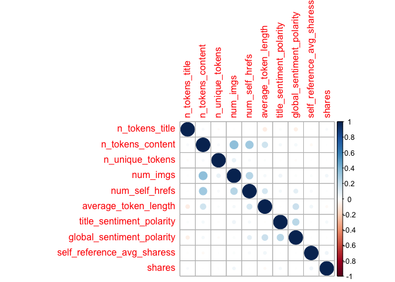
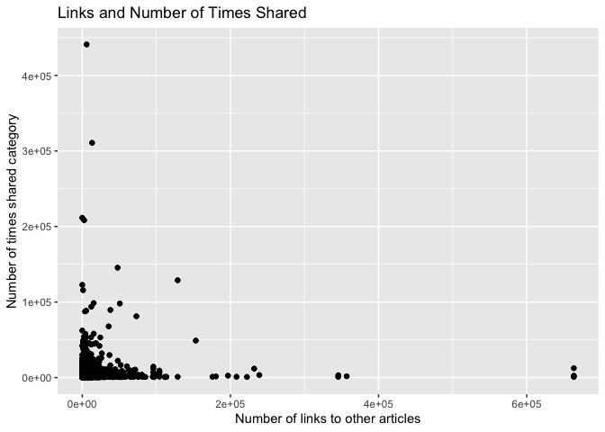

ProjectCode
================
Colleen Moore
10/8/2020

-   [Variable selection](#variable-selection)
-   [Create Training and Test Sets](#create-training-and-test-sets)
-   [Summarizations](#summarizations)
-   [Modeling](#modeling)
    -   [Tree based Model](#tree-based-model)
    -   [Boosted Tree Model](#boosted-tree-model)

*This analysis is for Tuesday*

Read in data

    news<- read_csv("OnlineNewsPopularity.csv")

    ## Parsed with column specification:
    ## cols(
    ##   .default = col_double(),
    ##   url = col_character()
    ## )

    ## See spec(...) for full column specifications.

Filter for the day of the week

    dailyNews <- filter(news, news[[paste0("weekday_is_",params$day)]] == "1")

### Variable selection

    dailyNews<- dailyNews %>% 
      mutate(channel= case_when(data_channel_is_bus == 1 ~ "Business",
                                             data_channel_is_entertainment==1 ~"Entertainment",
                                                data_channel_is_lifestyle== 1 ~ "Lifesytle",
                                                data_channel_is_socmed==1 ~ "SocialMedia",
                                                data_channel_is_tech==1 ~ "Tech",
                                                data_channel_is_world== 1 ~ "World")) %>% select(n_tokens_title, n_tokens_content, n_unique_tokens, num_imgs, num_self_hrefs, average_token_length, title_sentiment_polarity, global_sentiment_polarity, shares, channel)

Check dataset for missing values

    dailyNews %>% summarise_all(funs(sum(is.na(.))))

    ## # A tibble: 1 x 10
    ##   n_tokens_title n_tokens_content n_unique_tokens num_imgs num_self_hrefs
    ##            <int>            <int>           <int>    <int>          <int>
    ## 1              0                0               0        0              0
    ## # … with 5 more variables: average_token_length <int>,
    ## #   title_sentiment_polarity <int>, global_sentiment_polarity <int>,
    ## #   shares <int>, channel <int>

Since I created a new variable channel, some news articles did not fall
into any of the listed categories and so are NA values. Replace the NA
values with “None”

    dailyNews$channel <- ifelse(is.na(dailyNews$channel), "None", dailyNews$channel)

Create Training and Test Sets
-----------------------------

Split data into training and test set- 70% of the data will be used for
training and 30% will be used for testing.

    set.seed(2011)
    train <- sample(1:nrow(dailyNews), size = nrow(dailyNews)*0.7)
    test <- setdiff(1:nrow(dailyNews), train)
    dailyNewsTrain <- dailyNews[train, ]
    dailyNewsTest <- dailyNews[test, ]

Summarizations
--------------

Quick summary of all the variables in the dataset. Wanted to get an idea
of the ranges of the variables.

    kable(apply(dailyNewsTrain[1:9], 2, summary), caption = paste("Summary of Variables"), digits= 1)

<table>
<caption>
Summary of Variables
</caption>
<thead>
<tr>
<th style="text-align:left;">
</th>
<th style="text-align:right;">
n\_tokens\_title
</th>
<th style="text-align:right;">
n\_tokens\_content
</th>
<th style="text-align:right;">
n\_unique\_tokens
</th>
<th style="text-align:right;">
num\_imgs
</th>
<th style="text-align:right;">
num\_self\_hrefs
</th>
<th style="text-align:right;">
average\_token\_length
</th>
<th style="text-align:right;">
title\_sentiment\_polarity
</th>
<th style="text-align:right;">
global\_sentiment\_polarity
</th>
<th style="text-align:right;">
shares
</th>
</tr>
</thead>
<tbody>
<tr>
<td style="text-align:left;">
Min.
</td>
<td style="text-align:right;">
4.0
</td>
<td style="text-align:right;">
0.0
</td>
<td style="text-align:right;">
0.0
</td>
<td style="text-align:right;">
0.0
</td>
<td style="text-align:right;">
0.0
</td>
<td style="text-align:right;">
0.0
</td>
<td style="text-align:right;">
-1.0
</td>
<td style="text-align:right;">
-0.3
</td>
<td style="text-align:right;">
45.0
</td>
</tr>
<tr>
<td style="text-align:left;">
1st Qu.
</td>
<td style="text-align:right;">
9.0
</td>
<td style="text-align:right;">
248.0
</td>
<td style="text-align:right;">
0.5
</td>
<td style="text-align:right;">
1.0
</td>
<td style="text-align:right;">
1.0
</td>
<td style="text-align:right;">
4.5
</td>
<td style="text-align:right;">
0.0
</td>
<td style="text-align:right;">
0.1
</td>
<td style="text-align:right;">
901.0
</td>
</tr>
<tr>
<td style="text-align:left;">
Median
</td>
<td style="text-align:right;">
10.0
</td>
<td style="text-align:right;">
396.0
</td>
<td style="text-align:right;">
0.5
</td>
<td style="text-align:right;">
1.0
</td>
<td style="text-align:right;">
3.0
</td>
<td style="text-align:right;">
4.7
</td>
<td style="text-align:right;">
0.0
</td>
<td style="text-align:right;">
0.1
</td>
<td style="text-align:right;">
1300.0
</td>
</tr>
<tr>
<td style="text-align:left;">
Mean
</td>
<td style="text-align:right;">
10.4
</td>
<td style="text-align:right;">
538.1
</td>
<td style="text-align:right;">
0.7
</td>
<td style="text-align:right;">
4.5
</td>
<td style="text-align:right;">
3.3
</td>
<td style="text-align:right;">
4.5
</td>
<td style="text-align:right;">
0.1
</td>
<td style="text-align:right;">
0.1
</td>
<td style="text-align:right;">
3275.7
</td>
</tr>
<tr>
<td style="text-align:left;">
3rd Qu.
</td>
<td style="text-align:right;">
12.0
</td>
<td style="text-align:right;">
683.0
</td>
<td style="text-align:right;">
0.6
</td>
<td style="text-align:right;">
4.0
</td>
<td style="text-align:right;">
4.0
</td>
<td style="text-align:right;">
4.8
</td>
<td style="text-align:right;">
0.1
</td>
<td style="text-align:right;">
0.2
</td>
<td style="text-align:right;">
2600.0
</td>
</tr>
<tr>
<td style="text-align:left;">
Max.
</td>
<td style="text-align:right;">
19.0
</td>
<td style="text-align:right;">
7081.0
</td>
<td style="text-align:right;">
701.0
</td>
<td style="text-align:right;">
100.0
</td>
<td style="text-align:right;">
62.0
</td>
<td style="text-align:right;">
8.0
</td>
<td style="text-align:right;">
1.0
</td>
<td style="text-align:right;">
0.6
</td>
<td style="text-align:right;">
441000.0
</td>
</tr>
</tbody>
</table>

Correlation plot of variable choosen to be included in model. seeing if
any of the chosen variables are highly correlated with the response
variable shares or among each other.

    correlation <- dailyNewsTrain %>% keep(is.numeric) %>% cor()
    corrplot(correlation)

<!-- -->

Boxplots of all the variables to be used in the model to get an idea of
shape and if outliers are present.

    dailyNewsTrain %>%
    keep(is.numeric) %>%
    pivot_longer(everything()) %>%
    ggplot(aes(x = value)) +
    facet_wrap(~ name, scales = "free") +
    geom_boxplot()

<!-- -->

None of the variables appear to have a high correlation with the shares
variable. Below is a plot of number of links of other articles and
shares category.

    ggplot(dailyNewsTrain, aes(num_self_hrefs, shares))+ geom_point()+ geom_jitter() + labs(x= "Number of links to other articles", y= "Number of times shared category", title= "Links and Number of Times Shared")

<!-- -->

Modeling
--------

### Tree based Model

The first model is a classification tree-based model (not ensemble)
using leave one out cross validation. I will be using rpart from the
`caret` package for this tree.

    Tree_fit<- train(shares ~.,  data= dailyNewsTrain, method= "rpart",
                     trControl=trainControl(method = "LOOCV"),
                    preProcess = c("center", "scale"))

    Tree_fit

    ## CART 
    ## 
    ## 5173 samples
    ##    9 predictor
    ## 
    ## Pre-processing: centered (14), scaled (14) 
    ## Resampling: Leave-One-Out Cross-Validation 
    ## Summary of sample sizes: 5172, 5172, 5172, 5172, 5172, 5172, ... 
    ## Resampling results across tuning parameters:
    ## 
    ##   cp           RMSE      Rsquared      MAE     
    ##   0.004733183  11416.28  2.631613e-05  3373.118
    ##   0.005137517  11381.48  1.270082e-04  3295.076
    ##   0.011443858  11363.11  1.924669e-04  3534.216
    ## 
    ## RMSE was used to select the optimal model using the smallest value.
    ## The final value used for the model was cp = 0.01144386.

See how this model did on the training dataset

    pred_Tree_fit<- predict(Tree_fit, newdata= dailyNewsTest)
    modelA<- postResample(pred_Tree_fit, obs= dailyNewsTest$shares)
    modelA

    ##     RMSE Rsquared      MAE 
    ## 6494.818       NA 2986.467

### Boosted Tree Model

The next model is a classification boosted tree model with parameters
choosen using cross validation. I chose the Stochastic Gradient Boosting
method (gbm method).

    fit_control <- trainControl(method="cv", number=10)

    grid <- expand.grid(n.trees=c(25, 50, 100, 200,500), shrinkage=c(0.05, 0.1, 0.15),
                        n.minobsinnode = c(5,10, 15),interaction.depth=1)

    boostedTree <-train(shares ~ ., data= dailyNewsTrain, method='gbm', trControl=fit_control, tuneGrid=grid, verbose= FALSE)

    boostedTree

    ## Stochastic Gradient Boosting 
    ## 
    ## 5173 samples
    ##    9 predictor
    ## 
    ## No pre-processing
    ## Resampling: Cross-Validated (10 fold) 
    ## Summary of sample sizes: 4654, 4657, 4655, 4657, 4655, 4657, ... 
    ## Resampling results across tuning parameters:
    ## 
    ##   shrinkage  n.minobsinnode  n.trees  RMSE      Rsquared    MAE     
    ##   0.05        5               25      9344.550  0.01546180  3126.350
    ##   0.05        5               50      9353.006  0.01505371  3117.939
    ##   0.05        5              100      9377.060  0.01510974  3122.639
    ##   0.05        5              200      9396.465  0.01474307  3120.676
    ##   0.05        5              500      9414.878  0.01327359  3134.390
    ##   0.05       10               25      9346.434  0.01591417  3120.234
    ##   0.05       10               50      9354.585  0.01432797  3106.657
    ##   0.05       10              100      9372.957  0.01648696  3114.483
    ##   0.05       10              200      9381.287  0.01676096  3114.096
    ##   0.05       10              500      9386.118  0.01588595  3111.114
    ##   0.05       15               25      9342.487  0.01510386  3122.067
    ##   0.05       15               50      9350.131  0.01508285  3105.055
    ##   0.05       15              100      9377.602  0.01556265  3106.673
    ##   0.05       15              200      9386.634  0.01580958  3118.234
    ##   0.05       15              500      9393.008  0.01586097  3122.773
    ##   0.10        5               25      9347.008  0.01530123  3105.992
    ##   0.10        5               50      9385.139  0.01457139  3114.152
    ##   0.10        5              100      9401.427  0.01477940  3115.393
    ##   0.10        5              200      9422.354  0.01305824  3132.772
    ##   0.10        5              500      9435.538  0.01126954  3135.579
    ##   0.10       10               25      9346.975  0.01624294  3102.423
    ##   0.10       10               50      9371.581  0.01579274  3121.484
    ##   0.10       10              100      9383.852  0.01585286  3101.944
    ##   0.10       10              200      9392.739  0.01531049  3122.720
    ##   0.10       10              500      9399.618  0.01589245  3124.232
    ##   0.10       15               25      9357.147  0.01525215  3111.968
    ##   0.10       15               50      9368.593  0.01599377  3107.813
    ##   0.10       15              100      9379.807  0.01615505  3110.070
    ##   0.10       15              200      9383.741  0.01655070  3103.047
    ##   0.10       15              500      9409.610  0.01397803  3136.134
    ##   0.15        5               25      9377.207  0.01264062  3122.678
    ##   0.15        5               50      9407.799  0.01284869  3123.150
    ##   0.15        5              100      9415.317  0.01440591  3124.401
    ##   0.15        5              200      9428.472  0.01174835  3125.027
    ##   0.15        5              500      9456.465  0.01089819  3144.254
    ##   0.15       10               25      9363.942  0.01541759  3090.058
    ##   0.15       10               50      9395.083  0.01713221  3129.128
    ##   0.15       10              100      9398.555  0.01591790  3127.424
    ##   0.15       10              200      9405.310  0.01570007  3135.906
    ##   0.15       10              500      9436.745  0.01402295  3155.650
    ##   0.15       15               25      9358.653  0.01654478  3120.289
    ##   0.15       15               50      9385.367  0.01703026  3115.532
    ##   0.15       15              100      9387.353  0.01670121  3143.883
    ##   0.15       15              200      9404.743  0.01472176  3125.970
    ##   0.15       15              500      9419.526  0.01378948  3143.974
    ## 
    ## Tuning parameter 'interaction.depth' was held constant at a value of 1
    ## RMSE was used to select the optimal model using the smallest value.
    ## The final values used for the model were n.trees = 25, interaction.depth =
    ##  1, shrinkage = 0.05 and n.minobsinnode = 15.

Test the model on the test dataset.

    pred_boostedTree<- predict(boostedTree, newdata= dailyNewsTest)
    modelB<- postResample(pred_boostedTree, obs= dailyNewsTest$shares)
    modelB

    ##         RMSE     Rsquared          MAE 
    ## 6.465451e+03 1.013964e-02 2.990026e+03

Out of the two models, the one with the lowest RMSE of 6465.4507 was the
boosted tree model
