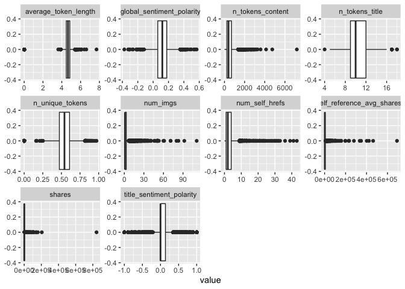

ProjectCode
================
Colleen Moore
10/8/2020

-   [Variable selection](#variable-selection)
-   [Create Training and Test Sets](#create-training-and-test-sets)
-   [Summarizations](#summarizations)
-   [Modeling](#modeling)
    -   [Tree based Model](#tree-based-model)
    -   [Boosted Tree Model](#boosted-tree-model)

*This analysis is for Wednesday*

Read in data

    news<- read_csv("OnlineNewsPopularity.csv")

    ## Parsed with column specification:
    ## cols(
    ##   .default = col_double(),
    ##   url = col_character()
    ## )

    ## See spec(...) for full column specifications.

Filter for the day of the week

    dailyNews <- filter(news, news[[paste0("weekday_is_",params$day)]] == "1")

### Variable selection

    dailyNews<- dailyNews %>% 
      mutate(channel= case_when(data_channel_is_bus == 1 ~ "Business",
                                             data_channel_is_entertainment==1 ~"Entertainment",
                                                data_channel_is_lifestyle== 1 ~ "Lifesytle",
                                                data_channel_is_socmed==1 ~ "SocialMedia",
                                                data_channel_is_tech==1 ~ "Tech",
                                                data_channel_is_world== 1 ~ "World")) %>% select(n_tokens_title, n_tokens_content, n_unique_tokens, num_imgs, num_self_hrefs, average_token_length, title_sentiment_polarity, global_sentiment_polarity, shares, channel)

Check dataset for missing values

    dailyNews %>% summarise_all(funs(sum(is.na(.))))

    ## # A tibble: 1 x 10
    ##   n_tokens_title n_tokens_content n_unique_tokens num_imgs num_self_hrefs
    ##            <int>            <int>           <int>    <int>          <int>
    ## 1              0                0               0        0              0
    ## # … with 5 more variables: average_token_length <int>,
    ## #   title_sentiment_polarity <int>, global_sentiment_polarity <int>,
    ## #   shares <int>, channel <int>

Since I created a new variable channel, some news articles did not fall
into any of the listed categories and so are NA values. Replace the NA
values with “None”

    dailyNews$channel <- ifelse(is.na(dailyNews$channel), "None", dailyNews$channel)

Create Training and Test Sets
-----------------------------

Split data into training and test set- 70% of the data will be used for
training and 30% will be used for testing.

    set.seed(2011)
    train <- sample(1:nrow(dailyNews), size = nrow(dailyNews)*0.7)
    test <- setdiff(1:nrow(dailyNews), train)
    dailyNewsTrain <- dailyNews[train, ]
    dailyNewsTest <- dailyNews[test, ]

Summarizations
--------------

Quick summary of all the variables in the dataset. Wanted to get an idea
of the ranges of the variables.

    kable(apply(dailyNewsTrain[1:9], 2, summary), caption = paste("Summary of Variables"), digits= 1)

<table>
<caption>
Summary of Variables
</caption>
<thead>
<tr>
<th style="text-align:left;">
</th>
<th style="text-align:right;">
n\_tokens\_title
</th>
<th style="text-align:right;">
n\_tokens\_content
</th>
<th style="text-align:right;">
n\_unique\_tokens
</th>
<th style="text-align:right;">
num\_imgs
</th>
<th style="text-align:right;">
num\_self\_hrefs
</th>
<th style="text-align:right;">
average\_token\_length
</th>
<th style="text-align:right;">
title\_sentiment\_polarity
</th>
<th style="text-align:right;">
global\_sentiment\_polarity
</th>
<th style="text-align:right;">
shares
</th>
</tr>
</thead>
<tbody>
<tr>
<td style="text-align:left;">
Min.
</td>
<td style="text-align:right;">
4.0
</td>
<td style="text-align:right;">
0.0
</td>
<td style="text-align:right;">
0.0
</td>
<td style="text-align:right;">
0
</td>
<td style="text-align:right;">
0.0
</td>
<td style="text-align:right;">
0.0
</td>
<td style="text-align:right;">
-1.0
</td>
<td style="text-align:right;">
-0.4
</td>
<td style="text-align:right;">
23.0
</td>
</tr>
<tr>
<td style="text-align:left;">
1st Qu.
</td>
<td style="text-align:right;">
9.0
</td>
<td style="text-align:right;">
244.0
</td>
<td style="text-align:right;">
0.5
</td>
<td style="text-align:right;">
1
</td>
<td style="text-align:right;">
1.0
</td>
<td style="text-align:right;">
4.5
</td>
<td style="text-align:right;">
0.0
</td>
<td style="text-align:right;">
0.1
</td>
<td style="text-align:right;">
885.8
</td>
</tr>
<tr>
<td style="text-align:left;">
Median
</td>
<td style="text-align:right;">
10.0
</td>
<td style="text-align:right;">
402.5
</td>
<td style="text-align:right;">
0.5
</td>
<td style="text-align:right;">
1
</td>
<td style="text-align:right;">
2.0
</td>
<td style="text-align:right;">
4.7
</td>
<td style="text-align:right;">
0.0
</td>
<td style="text-align:right;">
0.1
</td>
<td style="text-align:right;">
1300.0
</td>
</tr>
<tr>
<td style="text-align:left;">
Mean
</td>
<td style="text-align:right;">
10.4
</td>
<td style="text-align:right;">
529.9
</td>
<td style="text-align:right;">
0.5
</td>
<td style="text-align:right;">
4
</td>
<td style="text-align:right;">
3.1
</td>
<td style="text-align:right;">
4.5
</td>
<td style="text-align:right;">
0.1
</td>
<td style="text-align:right;">
0.1
</td>
<td style="text-align:right;">
3237.3
</td>
</tr>
<tr>
<td style="text-align:left;">
3rd Qu.
</td>
<td style="text-align:right;">
12.0
</td>
<td style="text-align:right;">
693.0
</td>
<td style="text-align:right;">
0.6
</td>
<td style="text-align:right;">
3
</td>
<td style="text-align:right;">
4.0
</td>
<td style="text-align:right;">
4.9
</td>
<td style="text-align:right;">
0.1
</td>
<td style="text-align:right;">
0.2
</td>
<td style="text-align:right;">
2600.0
</td>
</tr>
<tr>
<td style="text-align:left;">
Max.
</td>
<td style="text-align:right;">
18.0
</td>
<td style="text-align:right;">
7185.0
</td>
<td style="text-align:right;">
1.0
</td>
<td style="text-align:right;">
111
</td>
<td style="text-align:right;">
43.0
</td>
<td style="text-align:right;">
7.7
</td>
<td style="text-align:right;">
1.0
</td>
<td style="text-align:right;">
0.6
</td>
<td style="text-align:right;">
843300.0
</td>
</tr>
</tbody>
</table>

Correlation plot of variable choosen to be included in model. seeing if
any of the chosen variables are highly correlated with the response
variable shares or among each other.

    correlation <- dailyNewsTrain %>% keep(is.numeric) %>% cor()
    corrplot(correlation)

<!-- -->

Boxplots of all the variables to be used in the model to get an idea of
shape and if outliers are present.

    dailyNewsTrain %>%
    keep(is.numeric) %>%
    pivot_longer(everything()) %>%
    ggplot(aes(x = value)) +
    facet_wrap(~ name, scales = "free") +
    geom_boxplot()

<!-- -->

None of the variables appear to have a high correlation with the shares
variable. Below is a plot of number of links of other articles and
shares category.

    ggplot(dailyNewsTrain, aes(num_self_hrefs, shares))+ geom_point()+ geom_jitter() + labs(x= "Number of links to other articles", y= "Number of times shared category", title= "Links and Number of Times Shared")

<!-- -->

Modeling
--------

### Tree based Model

The first model is a classification tree-based model (not ensemble)
using leave one out cross validation. I will be using rpart from the
`caret` package for this tree.

    Tree_fit<- train(shares ~.,  data= dailyNewsTrain, method= "rpart",
                     trControl=trainControl(method = "LOOCV"),
                    preProcess = c("center", "scale"))

    Tree_fit

    ## CART 
    ## 
    ## 5204 samples
    ##    9 predictor
    ## 
    ## Pre-processing: centered (14), scaled (14) 
    ## Resampling: Leave-One-Out Cross-Validation 
    ## Summary of sample sizes: 5203, 5203, 5203, 5203, 5203, 5203, ... 
    ## Resampling results across tuning parameters:
    ## 
    ##   cp           RMSE      Rsquared     MAE     
    ##   0.003600675  14716.06  0.001518891  3133.995
    ##   0.003699568  14729.64  0.001401800  3192.173
    ##   0.039313667  14243.04  0.002227945  3461.166
    ## 
    ## RMSE was used to select the optimal model using the smallest value.
    ## The final value used for the model was cp = 0.03931367.

See how this model did on the training dataset

    pred_Tree_fit<- predict(Tree_fit, newdata= dailyNewsTest)
    modelA<- postResample(pred_Tree_fit, obs= dailyNewsTest$shares)
    modelA

    ##     RMSE Rsquared      MAE 
    ## 15493.32       NA  3312.33

### Boosted Tree Model

The next model is a classification boosted tree model with parameters
choosen using cross validation. I chose the Stochastic Gradient Boosting
method (gbm method).

    fit_control <- trainControl(method="cv", number=10)

    grid <- expand.grid(n.trees=c(25, 50, 100, 200,500), shrinkage=c(0.05, 0.1, 0.15),
                        n.minobsinnode = c(5,10, 15),interaction.depth=1)

    boostedTree <-train(shares ~ ., data= dailyNewsTrain, method='gbm', trControl=fit_control, tuneGrid=grid, verbose= FALSE)

    boostedTree

    ## Stochastic Gradient Boosting 
    ## 
    ## 5204 samples
    ##    9 predictor
    ## 
    ## No pre-processing
    ## Resampling: Cross-Validated (10 fold) 
    ## Summary of sample sizes: 4682, 4684, 4683, 4684, 4684, 4685, ... 
    ## Resampling results across tuning parameters:
    ## 
    ##   shrinkage  n.minobsinnode  n.trees  RMSE      Rsquared    MAE     
    ##   0.05        5               25      10802.19  0.01741467  3080.151
    ##   0.05        5               50      10818.84  0.01824202  3084.989
    ##   0.05        5              100      10859.13  0.01864018  3117.455
    ##   0.05        5              200      10875.14  0.01876572  3113.488
    ##   0.05        5              500      10891.50  0.01955178  3124.547
    ##   0.05       10               25      10802.45  0.01896710  3080.314
    ##   0.05       10               50      10818.93  0.01852184  3094.151
    ##   0.05       10              100      10855.49  0.01855768  3113.315
    ##   0.05       10              200      10867.15  0.01932861  3122.704
    ##   0.05       10              500      10883.14  0.02057834  3107.980
    ##   0.05       15               25      10798.19  0.01886990  3079.827
    ##   0.05       15               50      10811.15  0.01963560  3082.550
    ##   0.05       15              100      10833.74  0.01933654  3084.498
    ##   0.05       15              200      10853.35  0.01999995  3102.435
    ##   0.05       15              500      10882.87  0.02030707  3120.763
    ##   0.10        5               25      10827.17  0.01718662  3097.700
    ##   0.10        5               50      10852.43  0.01942386  3109.753
    ##   0.10        5              100      10865.88  0.02105037  3098.675
    ##   0.10        5              200      10877.88  0.01987868  3112.004
    ##   0.10        5              500      10924.63  0.01921691  3149.748
    ##   0.10       10               25      10807.83  0.02030825  3096.047
    ##   0.10       10               50      10853.47  0.01875276  3102.949
    ##   0.10       10              100      10871.34  0.01931560  3106.166
    ##   0.10       10              200      10878.22  0.02083630  3129.094
    ##   0.10       10              500      10921.59  0.01937103  3134.309
    ##   0.10       15               25      10808.34  0.01890683  3098.256
    ##   0.10       15               50      10842.20  0.01938977  3113.469
    ##   0.10       15              100      10856.07  0.02016124  3101.161
    ##   0.10       15              200      10881.07  0.01961028  3129.555
    ##   0.10       15              500      10926.27  0.01983628  3162.618
    ##   0.15        5               25      10849.84  0.01844339  3111.389
    ##   0.15        5               50      10856.10  0.02010865  3122.796
    ##   0.15        5              100      10884.83  0.01831498  3128.081
    ##   0.15        5              200      10916.23  0.01865760  3130.424
    ##   0.15        5              500      10989.87  0.01706465  3161.799
    ##   0.15       10               25      10843.99  0.01780058  3085.812
    ##   0.15       10               50      10866.05  0.01972966  3124.745
    ##   0.15       10              100      10873.49  0.02017488  3130.598
    ##   0.15       10              200      10910.94  0.02153280  3149.675
    ##   0.15       10              500      10960.52  0.01937060  3143.073
    ##   0.15       15               25      10832.76  0.01928131  3118.864
    ##   0.15       15               50      10847.58  0.02126796  3116.027
    ##   0.15       15              100      10854.50  0.02110471  3094.518
    ##   0.15       15              200      10882.08  0.02080528  3136.491
    ##   0.15       15              500      10939.30  0.01911362  3128.497
    ## 
    ## Tuning parameter 'interaction.depth' was held constant at a value of 1
    ## RMSE was used to select the optimal model using the smallest value.
    ## The final values used for the model were n.trees = 25, interaction.depth =
    ##  1, shrinkage = 0.05 and n.minobsinnode = 15.

Test the model on the test dataset.

    pred_boostedTree<- predict(boostedTree, newdata= dailyNewsTest)
    modelB<- postResample(pred_boostedTree, obs= dailyNewsTest$shares)
    modelB

    ##         RMSE     Rsquared          MAE 
    ## 1.540844e+04 1.959308e-02 3.256454e+03

Out of the two models, the one with the lowest RMSE of 1.5408445^{4} was
the boosted tree model
