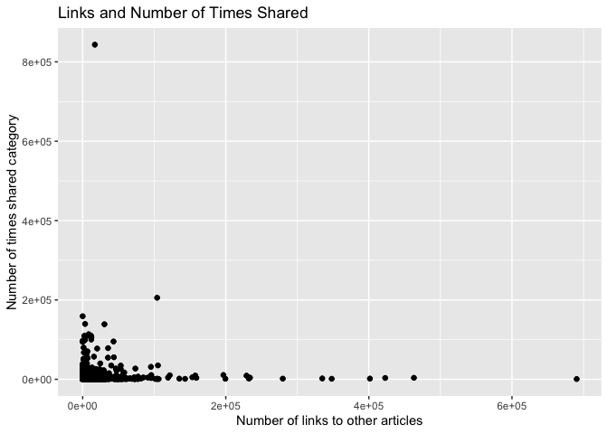

ProjectCode
================
Colleen Moore
10/8/2020

-   [\*\* Analysis for Wednesday \*\*](#analysis-for-wednesday)
    -   [Read in data](#read-in-data)
        -   [Filter for the day of the
            week](#filter-for-the-day-of-the-week)
    -   [Variable selection](#variable-selection)
        -   [Code for variable select and
            modification](#code-for-variable-select-and-modification)
        -   [Check dataset for missing
            values](#check-dataset-for-missing-values)
    -   [Create Training and Test Sets](#create-training-and-test-sets)
    -   [Summarizations](#summarizations)
        -   [Summary of all the included
            variables](#summary-of-all-the-included-variables)
        -   [Correlation plot](#correlation-plot)
        -   [Boxplots](#boxplots)
        -   [Scatterplot](#scatterplot)
    -   [Modeling](#modeling)
        -   [Tree based Model](#tree-based-model)
        -   [Boosted Tree Model](#boosted-tree-model)
    -   [Best Model](#best-model)

\*\* Analysis for Wednesday \*\*
================================

Read in data
------------

    news<- read_csv("OnlineNewsPopularity.csv")

### Filter for the day of the week

    dailyNews <- filter(news, news[[paste0("weekday_is_",params$day)]] == "1")

Variable selection
------------------

The variables I chose were:

-   n\_tokens\_title: Number of words in the title  
-   n\_tokens\_content: Number of words in the content  
-   n\_unique\_tokens: Rate of unique words in the content  
-   num\_imgs: Number of images  
-   num\_self\_hrefs: Number of links to other articles published by
    Mashable  
-   average\_token\_length: Average length of the words in the content  
-   self\_reference\_avg\_sharess: Avg. shares of referenced articles in
    Mashable
-   global\_sentiment\_polarity: Text sentiment polarity
-   data\_channel - which is a derived variable from:
    -   data\_channel\_is\_lifestyle: Is data channel ‘Lifestyle’?
    -   data\_channel\_is\_entertainment: Is data channel
        ‘Entertainment’?
    -   data\_channel\_is\_bus: Is data channel ‘Business’?
    -   data\_channel\_is\_socmed: Is data channel ‘Social Media’?
    -   data\_channel\_is\_tech: Is data channel ‘Tech’?
    -   data\_channel\_is\_world: Is data channel ‘World’?
-   title\_sentiment\_polarity: Title polarity

### Code for variable select and modification

    dailyNews<- dailyNews %>% 
      mutate(channel= case_when(data_channel_is_bus == 1 ~ "Business",
                                             data_channel_is_entertainment==1 ~"Entertainment",
                                                data_channel_is_lifestyle== 1 ~ "Lifesytle",
                                                data_channel_is_socmed==1 ~ "SocialMedia",
                                                data_channel_is_tech==1 ~ "Tech",
                                                data_channel_is_world== 1 ~ "World")) %>% 
      select(n_tokens_title, n_tokens_content, n_unique_tokens, num_imgs, num_self_hrefs, 
             average_token_length, title_sentiment_polarity, global_sentiment_polarity,
             self_reference_avg_sharess, shares, channel)

### Check dataset for missing values

    miss<- dailyNews %>% summarise_all(funs(sum(is.na(.))))
    kable(miss)

<table>
<thead>
<tr>
<th style="text-align:right;">
n\_tokens\_title
</th>
<th style="text-align:right;">
n\_tokens\_content
</th>
<th style="text-align:right;">
n\_unique\_tokens
</th>
<th style="text-align:right;">
num\_imgs
</th>
<th style="text-align:right;">
num\_self\_hrefs
</th>
<th style="text-align:right;">
average\_token\_length
</th>
<th style="text-align:right;">
title\_sentiment\_polarity
</th>
<th style="text-align:right;">
global\_sentiment\_polarity
</th>
<th style="text-align:right;">
self\_reference\_avg\_sharess
</th>
<th style="text-align:right;">
shares
</th>
<th style="text-align:right;">
channel
</th>
</tr>
</thead>
<tbody>
<tr>
<td style="text-align:right;">
0
</td>
<td style="text-align:right;">
0
</td>
<td style="text-align:right;">
0
</td>
<td style="text-align:right;">
0
</td>
<td style="text-align:right;">
0
</td>
<td style="text-align:right;">
0
</td>
<td style="text-align:right;">
0
</td>
<td style="text-align:right;">
0
</td>
<td style="text-align:right;">
0
</td>
<td style="text-align:right;">
0
</td>
<td style="text-align:right;">
1083
</td>
</tr>
</tbody>
</table>

Since I created a new variable channel, some news articles did not fall
into any of the listed categories and so are NA values. Replace the NA
values with “None”

    dailyNews$channel <- ifelse(is.na(dailyNews$channel), "None", dailyNews$channel)

Create Training and Test Sets
-----------------------------

Split data into training and test set- 70% of the data will be used for
training and 30% will be used for testing.

    set.seed(2011)
    train <- sample(1:nrow(dailyNews), size = nrow(dailyNews)*0.7)
    test <- setdiff(1:nrow(dailyNews), train)
    dailyNewsTrain <- dailyNews[train, ]
    dailyNewsTest <- dailyNews[test, ]

Summarizations
--------------

### Summary of all the included variables

Quick summary of all the variables in the dataset. Wanted to get an idea
of the ranges of the variables.

    kable(apply(dailyNewsTrain[1:10], 2, summary), caption = paste("Summary of Variables"), digits= 1)

<table>
<caption>
Summary of Variables
</caption>
<thead>
<tr>
<th style="text-align:left;">
</th>
<th style="text-align:right;">
n\_tokens\_title
</th>
<th style="text-align:right;">
n\_tokens\_content
</th>
<th style="text-align:right;">
n\_unique\_tokens
</th>
<th style="text-align:right;">
num\_imgs
</th>
<th style="text-align:right;">
num\_self\_hrefs
</th>
<th style="text-align:right;">
average\_token\_length
</th>
<th style="text-align:right;">
title\_sentiment\_polarity
</th>
<th style="text-align:right;">
global\_sentiment\_polarity
</th>
<th style="text-align:right;">
self\_reference\_avg\_sharess
</th>
<th style="text-align:right;">
shares
</th>
</tr>
</thead>
<tbody>
<tr>
<td style="text-align:left;">
Min.
</td>
<td style="text-align:right;">
4.0
</td>
<td style="text-align:right;">
0.0
</td>
<td style="text-align:right;">
0.0
</td>
<td style="text-align:right;">
0
</td>
<td style="text-align:right;">
0.0
</td>
<td style="text-align:right;">
0.0
</td>
<td style="text-align:right;">
-1.0
</td>
<td style="text-align:right;">
-0.4
</td>
<td style="text-align:right;">
0.0
</td>
<td style="text-align:right;">
23.0
</td>
</tr>
<tr>
<td style="text-align:left;">
1st Qu.
</td>
<td style="text-align:right;">
9.0
</td>
<td style="text-align:right;">
244.0
</td>
<td style="text-align:right;">
0.5
</td>
<td style="text-align:right;">
1
</td>
<td style="text-align:right;">
1.0
</td>
<td style="text-align:right;">
4.5
</td>
<td style="text-align:right;">
0.0
</td>
<td style="text-align:right;">
0.1
</td>
<td style="text-align:right;">
943.8
</td>
<td style="text-align:right;">
885.8
</td>
</tr>
<tr>
<td style="text-align:left;">
Median
</td>
<td style="text-align:right;">
10.0
</td>
<td style="text-align:right;">
402.5
</td>
<td style="text-align:right;">
0.5
</td>
<td style="text-align:right;">
1
</td>
<td style="text-align:right;">
2.0
</td>
<td style="text-align:right;">
4.7
</td>
<td style="text-align:right;">
0.0
</td>
<td style="text-align:right;">
0.1
</td>
<td style="text-align:right;">
2167.8
</td>
<td style="text-align:right;">
1300.0
</td>
</tr>
<tr>
<td style="text-align:left;">
Mean
</td>
<td style="text-align:right;">
10.4
</td>
<td style="text-align:right;">
529.9
</td>
<td style="text-align:right;">
0.5
</td>
<td style="text-align:right;">
4
</td>
<td style="text-align:right;">
3.1
</td>
<td style="text-align:right;">
4.5
</td>
<td style="text-align:right;">
0.1
</td>
<td style="text-align:right;">
0.1
</td>
<td style="text-align:right;">
6071.4
</td>
<td style="text-align:right;">
3237.3
</td>
</tr>
<tr>
<td style="text-align:left;">
3rd Qu.
</td>
<td style="text-align:right;">
12.0
</td>
<td style="text-align:right;">
693.0
</td>
<td style="text-align:right;">
0.6
</td>
<td style="text-align:right;">
3
</td>
<td style="text-align:right;">
4.0
</td>
<td style="text-align:right;">
4.9
</td>
<td style="text-align:right;">
0.1
</td>
<td style="text-align:right;">
0.2
</td>
<td style="text-align:right;">
5000.0
</td>
<td style="text-align:right;">
2600.0
</td>
</tr>
<tr>
<td style="text-align:left;">
Max.
</td>
<td style="text-align:right;">
18.0
</td>
<td style="text-align:right;">
7185.0
</td>
<td style="text-align:right;">
1.0
</td>
<td style="text-align:right;">
111
</td>
<td style="text-align:right;">
43.0
</td>
<td style="text-align:right;">
7.7
</td>
<td style="text-align:right;">
1.0
</td>
<td style="text-align:right;">
0.6
</td>
<td style="text-align:right;">
690400.0
</td>
<td style="text-align:right;">
843300.0
</td>
</tr>
</tbody>
</table>

### Correlation plot

Correlation plot of variable choosen to be included in model. Seeing if
any of the chosen variables are highly correlated with the response
variable shares or among each other.

    correlation <- dailyNewsTrain %>% keep(is.numeric) %>% cor()
    corrplot(correlation)

<!-- -->

None of the variables appear to have a high correlation with the shares
variable.

### Boxplots

Boxplots of all the variables to be used in the model to get an idea of
shape and if outliers are present.

    dailyNewsTrain %>%
    keep(is.numeric) %>%
    pivot_longer(everything()) %>%
    ggplot(aes(x = value)) +
    facet_wrap(~ name, scales = "free") +
    geom_boxplot()

<!-- -->

### Scatterplot

Below is a plot of self\_reference\_avg\_sharess (Avg. shares of
referenced articles in Mashable) and shares category.

    ggplot(dailyNewsTrain, aes(self_reference_avg_sharess,shares))+ 
      geom_point()+ geom_jitter() + 
      labs(x= "Number of links to other articles", y= "Number of times shared category", 
           title= "Links and Number of Times Shared")

<!-- -->

Modeling
--------

### Tree based Model

The first model is a classification tree-based model (not ensemble)
using leave one out cross validation. I will be using rpart from the
`caret` package for this tree.

    Tree_fit<- train(shares ~.,  data= dailyNewsTrain, method= "rpart",
                     trControl=trainControl(method = "LOOCV"),
                    preProcess = c("center", "scale"))

    Tree_fit

    ## CART 
    ## 
    ## 5204 samples
    ##   10 predictor
    ## 
    ## Pre-processing: centered (15), scaled (15) 
    ## Resampling: Leave-One-Out Cross-Validation 
    ## Summary of sample sizes: 5203, 5203, 5203, 5203, 5203, 5203, ... 
    ## Resampling results across tuning parameters:
    ## 
    ##   cp           RMSE      Rsquared      MAE     
    ##   0.003621180  14834.51  4.103995e-05  3187.545
    ##   0.008667258  14775.35  8.112038e-05  3181.263
    ##   0.049272241  14823.16  1.930588e-04  3481.850
    ## 
    ## RMSE was used to select the optimal model using the smallest value.
    ## The final value used for the model was cp = 0.008667258.

Test the tree based model on the test data set.

    pred_Tree_fit<- predict(Tree_fit, newdata= dailyNewsTest)
    modelA<- postResample(pred_Tree_fit, obs= dailyNewsTest$shares)
    modelA

    ##         RMSE     Rsquared          MAE 
    ## 1.568863e+04 2.194519e-04 3.273093e+03

### Boosted Tree Model

The next model is a classification boosted tree model with parameters
choosen using cross validation. I chose the Stochastic Gradient Boosting
method (gbm method).

    fit_control <- trainControl(method="cv", number=10)

    grid <- expand.grid(n.trees=c(25, 50, 100, 200,500), shrinkage=c(0.05, 0.1, 0.15),
                        n.minobsinnode = c(5,10, 15),interaction.depth=1)

    boostedTree <-train(shares ~ ., data= dailyNewsTrain, method='gbm',
                        trControl=fit_control, tuneGrid=grid, verbose= FALSE)

    boostedTree

    ## Stochastic Gradient Boosting 
    ## 
    ## 5204 samples
    ##   10 predictor
    ## 
    ## No pre-processing
    ## Resampling: Cross-Validated (10 fold) 
    ## Summary of sample sizes: 4682, 4684, 4683, 4684, 4684, 4685, ... 
    ## Resampling results across tuning parameters:
    ## 
    ##   shrinkage  n.minobsinnode  n.trees  RMSE      Rsquared    MAE     
    ##   0.05        5               25      10784.40  0.02750299  3073.254
    ##   0.05        5               50      10793.14  0.02834141  3066.009
    ##   0.05        5              100      10844.98  0.02854544  3105.801
    ##   0.05        5              200      10862.36  0.02811112  3106.252
    ##   0.05        5              500      10883.71  0.02741350  3112.964
    ##   0.05       10               25      10779.86  0.03039747  3069.797
    ##   0.05       10               50      10788.07  0.02990364  3072.969
    ##   0.05       10              100      10833.22  0.02863773  3098.465
    ##   0.05       10              200      10856.43  0.02921820  3110.646
    ##   0.05       10              500      10866.76  0.02966260  3095.113
    ##   0.05       15               25      10776.30  0.03020617  3066.902
    ##   0.05       15               50      10782.07  0.03052544  3059.401
    ##   0.05       15              100      10810.72  0.02908238  3066.682
    ##   0.05       15              200      10838.86  0.02954854  3088.247
    ##   0.05       15              500      10860.73  0.02946090  3098.848
    ##   0.10        5               25      10801.15  0.02569093  3078.859
    ##   0.10        5               50      10847.08  0.02782502  3101.534
    ##   0.10        5              100      10863.91  0.02907549  3093.989
    ##   0.10        5              200      10875.61  0.02796525  3107.335
    ##   0.10        5              500      10913.09  0.02582719  3139.959
    ##   0.10       10               25      10786.06  0.03007863  3077.127
    ##   0.10       10               50      10844.41  0.02836947  3091.880
    ##   0.10       10              100      10867.62  0.02731445  3096.936
    ##   0.10       10              200      10874.97  0.02778993  3119.816
    ##   0.10       10              500      10898.20  0.02747670  3118.767
    ##   0.10       15               25      10775.55  0.02935110  3075.210
    ##   0.10       15               50      10826.46  0.02968609  3095.549
    ##   0.10       15              100      10835.71  0.02979852  3077.092
    ##   0.10       15              200      10852.46  0.02900639  3094.998
    ##   0.10       15              500      10884.28  0.02891548  3120.627
    ##   0.15        5               25      10834.36  0.02954461  3093.099
    ##   0.15        5               50      10853.32  0.02901688  3121.657
    ##   0.15        5              100      10868.30  0.02896047  3121.250
    ##   0.15        5              200      10911.85  0.02804913  3131.521
    ##   0.15        5              500      10937.52  0.02626566  3142.825
    ##   0.15       10               25      10830.64  0.02626642  3072.955
    ##   0.15       10               50      10868.15  0.02748133  3116.207
    ##   0.15       10              100      10871.94  0.02804063  3118.028
    ##   0.15       10              200      10907.85  0.02682575  3136.248
    ##   0.15       10              500      10904.32  0.02731787  3119.255
    ##   0.15       15               25      10797.00  0.03080304  3086.895
    ##   0.15       15               50      10836.96  0.02935954  3098.505
    ##   0.15       15              100      10840.48  0.03019547  3088.134
    ##   0.15       15              200      10860.23  0.02948640  3119.051
    ##   0.15       15              500      10882.16  0.02800409  3106.226
    ## 
    ## Tuning parameter 'interaction.depth' was held constant at a value of 1
    ## RMSE was used to select the optimal model using the smallest value.
    ## The final values used for the model were n.trees = 25, interaction.depth =
    ##  1, shrinkage = 0.1 and n.minobsinnode = 15.

Test the model on the test dataset.

    pred_boostedTree<- predict(boostedTree, newdata= dailyNewsTest)
    modelB<- postResample(pred_boostedTree, obs= dailyNewsTest$shares)
    modelB

    ##         RMSE     Rsquared          MAE 
    ## 1.538095e+04 1.563808e-02 3.277050e+03

Best Model
----------

Out of the two models, the one with the lowest RMSE of 1.5380951^{4} was
the boosted tree model
